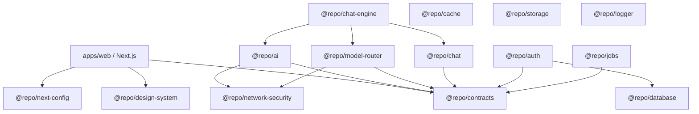
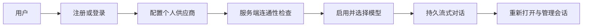

# Chat Design Baseline

> 状态：M0 工程骨架、Goal 1、Goal 2 聊天竖切与 Goal 3 用户供应商管理纵切已完成；用户配置接入聊天模型选择和会话记录管理仍为下一阶段。除明确标为「已实现」的内容外，本文均为规划。
> 产品事实源：`docs/architecture/implementation-goals.md`
> 参考边界：`docs/DEEIX_FEATURE_INVENTORY.zh-CN.md` 与 `docs/DEEIX_REIMPLEMENTATION_ARCHITECTURE.zh-CN.md` 只保存历史研究和可复用方案，不再定义产品路线或完成标准。

## 产品方向

Chat 的第一阶段是一个供个人学习和日常使用的多模型 Chatbot。用户登录后配置自己的模型供应商密钥，选择模型并进行持久对话；再次进入时可以找到、打开和管理此前的会话。

这一阶段只保留四类用户能力：

1. **鉴权**：注册、登录、验证、恢复密码和退出。
2. **对话记录**：新建、打开、重命名、归档或删除会话。
3. **对话**：选择模型、发送消息、查看流式回答、停止生成和刷新恢复。
4. **供应商配置**：用户配置自己的 API Key，检查连通性，启用可用模型。

首批入口固定为 Anthropic-compatible、OpenAI-compatible、Gemini-compatible、Grok-compatible 与 DeepSeek-compatible。五项都允许填写经过服务端网络策略校验的兼容 Base URL；已经存在的其他 adapter 可以继续保留在代码中，但不因此进入 v1 产品界面。

## 截图参考的取舍

参考截图提供了可借鉴的交互结构：左侧显示会话历史，主区域显示消息与底部输入框，输入框附近提供模型选择，设置页集中配置供应商。

下列截图内容不进入第一阶段：

- 首页中的任务、资源、Agent 市场与跨渠道入口。
- 使用量、点数、订阅、账单和价格展示。
- Skill、MCP、连接器、工具权限和 OAuth 应用。
- 大而全的供应商市场、管理员统一路由和运营后台。
- 文件、知识库、记忆、图片、视频和 Artifact。

供应商设置属于当前登录用户，不属于管理员后台。API Key 只提交到服务端并加密保存，浏览器不能直接持有密钥或绕过服务端调用上游。

## 设计原则

- 学习路径可追踪：每项功能都能从页面、HTTP 边界、应用服务、数据库一直读到外部模型调用。
- 对话优先：首 token 延迟、停止、刷新恢复和错误可解释性优先于后台任务统一性。
- 范围受控：先完成一条可用流程，再根据实际学习目标添加能力。
- Provider 中立：AI SDK 负责模型调用，不负责用户权限、会话事实、凭证存储或产品路线。
- 密钥留在服务端：数据库只保存密文和非敏感元数据；route snapshot、日志、浏览器响应均不得包含明文密钥。
- 部署诚实：当前 Vercel/Docker 配置继续可用；个人 BYOK 需要独立加密主密钥和显式 migration，尚未接入聊天运行时的部分不写成已完成。
- 依赖向内：领域 contract 不依赖 Next.js、数据库、Redis、对象存储或任务 SDK。
- 文档伴生：架构、目录地图和代码 Header 随实现一起演进。

## 当前架构（已实现）

Browser 已通过 `useChat` 自定义 durable transport 接入 Web。conversation/run 创建和 PostgreSQL checkpoint SSE 是服务端事实，AI SDK `UIMessage` 只承担渲染状态。当前 package 和 API 的实际能力以各架构文档「状态」段为准；已有 package 骨架不代表对应产品功能已完成。

## v1 用户流程（部分实现）

鉴权、持久流式对话和个人供应商配置已实现。把用户供应商配置解析为聊天可选模型，以及完整会话列表仍为 Goal 3 规划。

第一阶段只需要三组产品页面：

- 公开鉴权页。
- `/chat`：左侧会话列表，右侧空状态或当前对话，底部输入框和模型选择器。
- `/settings/providers`：供应商列表和单个供应商配置页。

无需单独复制 LobeHub 首页；没有选中会话时的 `/chat` 空状态即可承担新对话入口。

## v1 供应商模型（已实现管理纵切）

用户级 `ProviderConnection` 当前包含以下事实：

- owner、provider preset、启用状态和非敏感显示信息。
- AES-256-GCM envelope 加密后的 credential payload；公开应用结果只表达 `hasCredential`，明文只在服务端检查调用栈短暂停留。
- 官方 endpoint 或经过 SSRF/DNS policy 校验的自定义 Base URL。
- 最近一次连通性检查的状态、时间和经过归一化的错误类别。
- 单个默认模型 ID 与供应商启用状态。模型列表发现和聊天模型选择器接入尚未实现。

v1 不建立管理员全局 Provider 市场，也不实现 priority、weight、failover、circuit 或计费倍率。一个聊天 run 固定使用一个用户已启用的模型 route，现有无密钥 route snapshot、checkpoint 和取消语义继续生效。

## Package 边界

| Package | 地位 | 禁止事项 |
| --- | --- | --- |
| `contracts` | 公共 Zod schema、聊天与模型目录稳定类型和错误码 | 不依赖框架或基础设施 |
| `chat` | 会话/message/run 领域模型、状态机、ports 和应用服务 | 不依赖 Web、AI SDK、Drizzle、Redis 或任务实现 |
| `chat-engine` | route、secret、AI stream、checkpoint 与取消/终态的执行编排 | 不依赖 Next.js、ORM、Redis 或任务 SDK，不持久化密钥/provider raw 数据 |
| `auth` | Better Auth 功能配置、Drizzle adapter、server/client factory 与 OwnerId 映射 | 不向领域泄漏 session/plugin 类型，不在 import 阶段读取环境或连接数据库 |
| `ai` | AI SDK、provider 与协议适配 | 不访问数据库、凭证存储、计费或任务系统 |
| `model-router` | 四层模型目录、管理用例、网络目标策略与 route 解析 | 不依赖 AI SDK、Drizzle、Next.js、计费或任务实现 |
| `network-security` | URL/DNS/IP policy 与 Node 连接时 pinned transport | 不承载模型、MCP、文件或存储业务规则 |
| `database` | Drizzle、聊天/认证/模型目录 migration 与 repository adapter | 不依赖 Web 组件；明文密钥不得进入普通查询结果 |
| `cache` | Redis/Upstash/Memory primitive | 不承载业务规则 |
| `storage` | Blob/S3/Local 对象边界 | 不决定文件业务状态 |
| `jobs` | job name、payload、driver contract | 不导出具体 Trigger task 实现 |
| `logger` | 结构化日志与未来 trace 装配 | 不替代审计和账本事实，不记录密钥 |
| `design-system` | Base Rhea、Base UI、Chat primitives、Streamdown、token 和基础样式 | 不包含聊天业务状态，不混用 Radix-only primitive |

Goal 3 已复用现有边界：领域 contract/service 位于 `model-router`，密文 repository 位于 `database`，AES-GCM vault、AI verifier 与 Next.js composition 位于 `apps/web/server`。只有当 credential vault 出现第二个真实使用方时，再评估是否从 Web composition 中独立拆包。

## 数据与运行状态

已实现：`@repo/contracts` 与 `@repo/chat` 已定义版本化消息内容、消息树、run/message 状态、重要事件、usage/failure 快照、repository ports 和显式 run 状态机；`@repo/database` 已提交聊天、认证、模型目录和用户供应商连接的约束、migration 与 repository adapter。模型目录、首批文本 adapter、共享网络安全、单 route 执行器、Next.js HTTP/checkpoint 边界、单模型环境 bootstrap，以及五项用户 BYOK 管理/检查纵切均已完成。完整规则见 [`chat-core.md`](./docs/architecture/chat-core.md)、[`chat-execution.md`](./docs/architecture/chat-execution.md)、[`chat-http.md`](./docs/architecture/chat-http.md)、[`model-bootstrap.md`](./docs/architecture/model-bootstrap.md)、[`model-catalog.md`](./docs/architecture/model-catalog.md)、[`ai-adapters.md`](./docs/architecture/ai-adapters.md) 与 [`network-security.md`](./docs/architecture/network-security.md)。

部分实现：Goal 3 已增加用户供应商连接、加密 credential、供应商启用状态和连通性检查；下一步把它们接入聊天 route/model selector，并补齐会话管理用例。任何 schema 变化都通过追加 migration 完成；不会在未知数据库上自动迁移。

## 身份边界（已实现）

Better Auth 1.6 + Drizzle adapter 已提供邮箱/密码、邮箱验证、数据库 session、密码重置撤销、Admin plugin、PostgreSQL 限流、Next.js Route Handler、Resend adapter、server/client factory 与唯一 `OwnerId` 映射。聊天领域只接收稳定字符串 `OwnerId`，不依赖 Better Auth 类型。Goal 3 的会话和供应商配置都必须 owner-scoped；Admin plugin 的存在不代表需要管理员产品后台。完整规则见 [`auth.md`](./docs/architecture/auth.md)。

## 部署现状

当前 Vercel 与 Docker 仍通过 `CHAT_MODEL_*` bootstrap 一个环境级聊天模型；用户供应商设置另要求 `PROVIDER_CREDENTIAL_ENCRYPTION_KEY`，但尚未替代聊天运行时的环境 route。Vercel 使用原生 Next.js 产物，非 Vercel 环境生成 standalone 输出；Compose 提供 PostgreSQL、显式 migration 和 Web 健康检查。详细命令见 [`deployment.md`](./docs/architecture/deployment.md)。

Redis、对象存储、Trigger.dev 和独立 worker 都不属于 Learning Chatbot v1 的运行依赖。

## 界面基线

- 中性、清楚、克制，优先信息层级和状态，不使用无语义渐变、发光或毛玻璃。
- 默认使用 `@repo/design-system` 中仓库自有的 Base Rhea + Base UI primitive 和语义 token。
- Server Component 优先；交互、浏览器 API 或客户端状态才使用 Client Component。
- 页面保持单一 `h1`，键盘、焦点、对比度和响应式属于完成标准。
- 危险操作需要明确确认，错误不暴露凭证、上游原文或内部堆栈。
- Assistant 文本统一进入 Streamdown；MessageScroller 只负责滚动和锚点，不持有聊天状态。

## 后续能力的处理方式

Skill、MCP、工具、文件/RAG、媒体、计费、团队与管理员后台不再作为排好顺序的固定 Goal。v1 完成后只根据新的学习目标选择一个小功能继续，例如文件上传或单个工具调用，并为它单独定义范围和退出条件。现有 `jobs`、`cache`、`storage` 骨架可以保留，但当前不扩展实现，也不把 Trigger.dev 设为聊天主链路依赖。

## 架构变更协议

修改 package 边界、主流程、数据模型、执行分级或部署 profile 时：

1. 使用 `$fractal-document`。
2. 更新受影响源码 Header 和最近的 `.folder.md`。
3. 更新本文件对应章节。
4. 如果实现与历史 DEEIX 研究方案出现差异，在当前事实源中明确记录，不回写研究样本来制造一致性。
