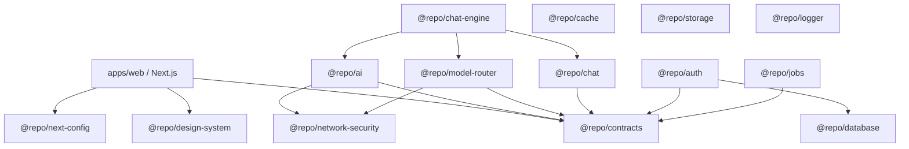
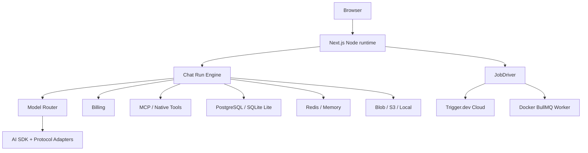

# Chat Design Baseline

> 状态：M0 已建立工程骨架；本文件中的业务架构除明确标为“已实现”的部分外均为规划。
> 研究依据：`docs/DEEIX_FEATURE_INVENTORY.zh-CN.md`、`docs/DEEIX_REIMPLEMENTATION_ARCHITECTURE.zh-CN.md`

## 产品方向

Chat 目标是一个比大型 AI 工作台更轻、但具备可靠模型网关能力的聊天平台：普通用户可以直接聊天、使用文件和工具；管理员可以管理多上游协议、路由、熔断、计费和运行状态。默认部署必须简单，高级能力通过可选基础设施逐步开启。

## 设计原则

- 对话优先：首 token 延迟、停止、刷新恢复和错误可解释性优先于后台任务统一性。
- 轻量分层：基础聊天不依赖 Trigger.dev；长任务才进入 JobDriver。
- Provider 中立：AI SDK 是调用基础，不是路由、账单或历史数据模型。
- 部署诚实：Vercel Core、Vercel Full、Docker Lite、Docker Full 明确标注能力差异。
- 依赖向内：领域 contract 不依赖 Next.js、数据库、Redis、对象存储或任务 SDK。
- 文档伴生：架构、目录地图和代码 Header 随实现一起演进。

## 当前架构

已实现的 M0 结构：

当前 package 和 API 的实际能力以各架构文档“状态”段为准；空骨架不等同于具体业务完成。

## 目标运行架构（规划）

## 执行分级（规划）

| 等级 | 任务 | 执行方式 |
| --- | --- | --- |
| 交互流 | 普通聊天、短工具循环 | Next.js Route Handler 直接流式执行 |
| 后台任务 | 文件提取、OCR、Embedding、reindex | JobDriver |
| 长媒体/运营 | 视频轮询、批量导出、价格同步、对账与清理 | JobDriver |

停止聊天是 run 的显式取消，不要求 Trigger.dev。刷新恢复依赖持久 run id、事件序号和重订阅，也不等于任务队列。

## Package 边界

| Package | 地位 | 禁止事项 |
| --- | --- | --- |
| `contracts` | 公共 Zod schema、聊天与模型目录稳定类型和错误码 | 不依赖框架或基础设施 |
| `chat` | 会话/message/run 领域模型、状态机、ports 和应用服务 | 不依赖 Web、AI SDK、Drizzle、Redis 或任务实现 |
| `chat-engine` | route、secret、AI stream、checkpoint 与取消/终态的执行编排 | 不依赖 Next.js、ORM、Redis 或 Trigger，不持久化密钥/provider raw 数据 |
| `auth` | Better Auth 功能配置、Drizzle adapter、server/client factory 与 OwnerId 映射 | 不向领域泄漏 session/plugin 类型，不在 import 阶段读取环境或连接数据库 |
| `ai` | AI SDK、provider 与协议适配 | 不访问数据库、计费或任务系统 |
| `model-router` | 四层模型目录、管理用例、网络目标策略与 route 解析 | 不依赖 AI SDK、Drizzle、Next.js、计费或任务实现 |
| `network-security` | URL/DNS/IP policy 与 Node 连接时 pinned transport | 不承载模型、MCP、文件或存储业务规则 |
| `database` | Drizzle、聊天/认证/模型目录 migration 与 repository adapter | 不依赖 Web 组件 |
| `cache` | Redis/Upstash/Memory primitive | 不承载业务规则 |
| `storage` | Blob/S3/Local 对象边界 | 不决定文件业务状态 |
| `jobs` | job name、payload、driver contract | 不导出具体 Trigger task 实现 |
| `logger` | 结构化日志与未来 trace 装配 | 不替代审计和账本事实 |
| `design-system` | Base Rhea、Base UI、Chat primitives、Streamdown、token 和基础样式 | 不包含聊天业务状态，不混用 Radix-only primitive |

业务增长后再按实际依赖新增 `billing`、`files`、`rag`、`tools`、`media`、`moderation` 和 `trigger`；不提前创建空包。`chat` 已因 Goal 1 的领域状态与 ports 建立真实职责，`auth` 已因 Goal 2 的 Better Auth 组合和身份映射建立真实职责，`model-router` 已因 Goal 2.3 的四层目录、管理规则和单-route 解析建立真实职责，`network-security` 已因 Goal 2.4 的共享 SSRF 与连接时 DNS pinning 建立真实职责，`chat-engine` 已因 Goal 2.5 的 route/secret/stream/checkpoint/cancel 编排建立真实职责。

## 数据与运行状态

已实现：`@repo/contracts` 与 `@repo/chat` 已定义版本化消息内容、消息树、run/message 状态、重要事件、usage/failure 快照、repository ports 和显式 run 状态机；`@repo/database` 已提交聊天事实表、约束、migration 与事务化 repository adapter。Goal 2.3 实现稳定模型 contract、`@repo/model-router` 管理用例/fail-closed 单 route 解析，以及四层 PostgreSQL CRUD/CAS；Goal 2.4 实现首批文本 provider adapter、稳定 usage、共享 URL/DNS 安全策略和连接时 pinning；Goal 2.5 已实现 `@repo/chat-engine`，运行时解析 credential reference 并固定不含密钥的 route snapshot，消费 AI SDK stream、周期 checkpoint，同时以 AbortSignal 和数据库状态监察取消；Next.js HTTP 边界已提供 owner-scoped snapshot、有限 SSE cursor、刷新恢复与显式取消；Goal 2.6a 已提供 Vercel/Docker 共用且不覆盖既有配置的单模型环境 bootstrap。完整规则见 [`docs/architecture/chat-core.md`](./docs/architecture/chat-core.md)、[`docs/architecture/chat-execution.md`](./docs/architecture/chat-execution.md)、[`docs/architecture/chat-http.md`](./docs/architecture/chat-http.md)、[`docs/architecture/model-bootstrap.md`](./docs/architecture/model-bootstrap.md)、[`docs/architecture/model-catalog.md`](./docs/architecture/model-catalog.md)、[`docs/architecture/ai-adapters.md`](./docs/architecture/ai-adapters.md) 与 [`docs/architecture/network-security.md`](./docs/architecture/network-security.md)。管理 HTTP/UI 和完整 resolver/failover 仍在后续功能中。

规划：

- PostgreSQL + pgvector 是 Vercel 与 Docker Full 的生产主线。
- SQLite + sqlite-vec 只用于 Docker Lite 单实例。
- Redis/Upstash 承载 run events、circuit、rate limit、cancel flag 和分布式缓存。
- Vercel Blob、S3-compatible、Local filesystem 通过 ObjectStore port 接入。
- 所有 run、route、usage、price 和 provider identity 保存不可变快照。

## 身份边界（部分实现）

Goal 2 已固定 Better Auth 1.6 + Drizzle adapter，实现邮箱/密码、邮箱验证、数据库 session、密码重置撤销、Admin plugin、PostgreSQL 限流、Next.js Route Handler、Resend adapter、server/client factory 与唯一 `OwnerId` 映射。聊天领域只接收稳定字符串 `OwnerId`，不依赖 Better Auth 类型；Vercel 和 Docker 共享 auth schema/migration 和 session 语义。认证 UI 尚未实现。完整规则见 [`docs/architecture/auth.md`](./docs/architecture/auth.md)。

## 部署

Goal 1 已实现构建 profile 分离：Vercel 检测到系统变量 `VERCEL=1` 时使用平台原生 Next.js 产物；非 Vercel 环境生成 `output: standalone`。多阶段 Docker image 以非 root 用户运行 standalone server，Compose 提供 PostgreSQL、显式 migration 和 Web 健康检查。详细命令与当前能力矩阵见 [`docs/architecture/deployment.md`](./docs/architecture/deployment.md)。下列完整基础设施 profile 仍为规划。

| Profile | 基础设施 | 定位 |
| --- | --- | --- |
| Vercel Core | Next.js + Neon + Blob | 一键基础聊天，长任务受限 |
| Vercel Full | Core + Upstash + Trigger.dev Cloud | 完整云部署 |
| Docker Lite | Next.js + SQLite + Memory + Local | 个人单实例 |
| Docker Full | Web/Worker + PostgreSQL + Redis + S3/Local | 完整自托管 |

## 界面基线

- 中性、清楚、克制，优先信息层级和状态，不使用无语义渐变、发光或毛玻璃。
- 默认使用 `@repo/design-system` 中仓库自有的 Base Rhea + Base UI primitive 和语义 token。
- Server Component 优先；交互、浏览器 API 或客户端状态才使用 Client Component。
- 页面保持单一 `h1`，键盘、焦点、对比度和响应式属于完成标准。
- 危险操作需要明确确认，错误不暴露凭证、上游原文或内部堆栈。

## 前端渲染基线

已实现预备层：shadcn Message/Bubble/Attachment/Marker、`@shadcn/react/message-scroller`、`@ai-sdk/react` 依赖和最小 `StreamingMarkdown`；后端 SSE Route Handler、持久 snapshot 与 cursor 刷新恢复已实现。聊天页面、typed UIMessage part registry 与浏览器 SSE client 仍为规划。

- Assistant 文本统一进入 Streamdown；代码与 Mermaid 插件按内容动态加载。
- MessageScroller 负责滚动和锚点，不持有聊天状态。
- AI Elements 不作为 Base UI 项目的基础依赖；工具、reasoning、来源和媒体按 typed part 自有组合。
- 完整边界、状态和延迟依赖见 [`docs/architecture/frontend-stack.md`](./docs/architecture/frontend-stack.md)。

## 架构变更协议

修改 package 边界、主流程、数据模型、执行分级或部署 profile 时：

1. 使用 `$fractal-document`。
2. 更新受影响源码 Header 和最近的 `.folder.md`。
3. 更新本文件对应章节。
4. 如果研究基线与实现出现有意差异，在相关文档中记录决策，不静默漂移。
