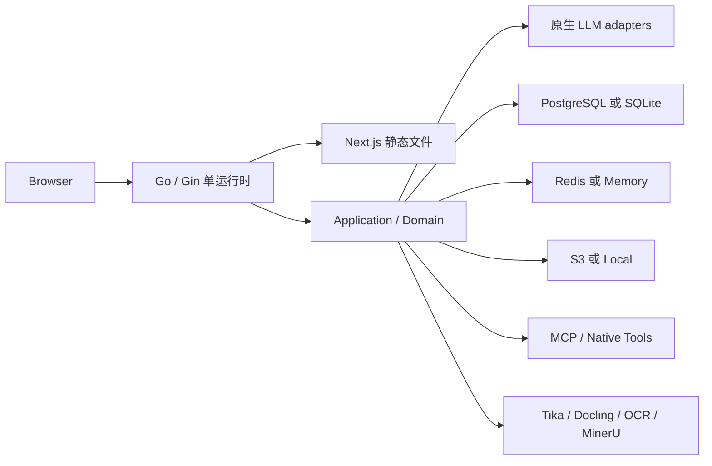
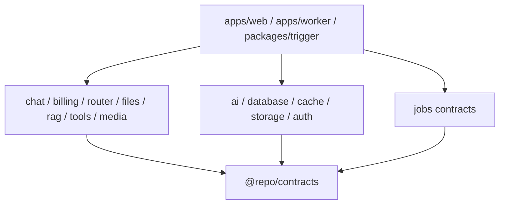
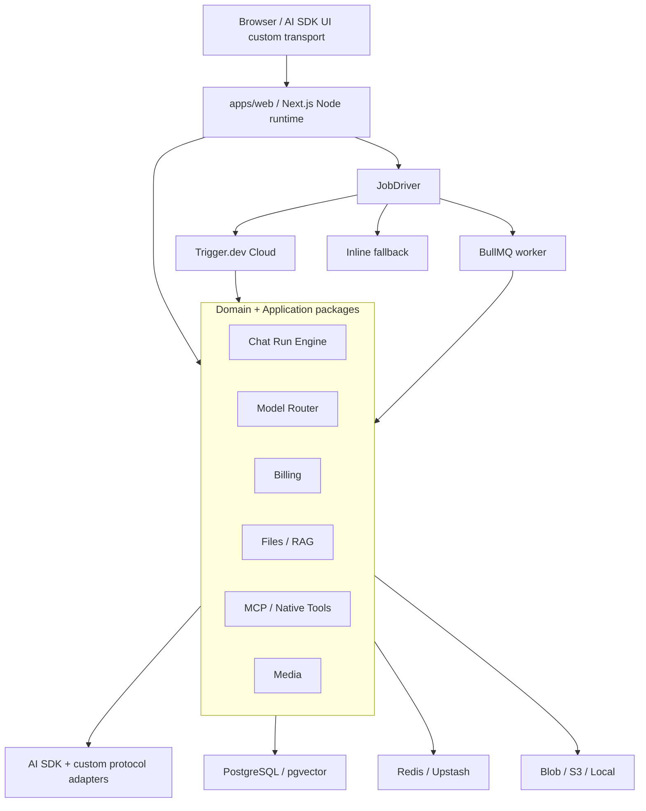

# DEEIX 等价复刻与 Next.js Monorepo 技术方案

> 方案状态：实现前架构基线
> 编写日期：2026-08-11
> DEEIX 审计基线：`dev@2753b98`，版本 `0.3.4`
> 目标前提：参考本地 `../news` 项目的 Bun + Turborepo Monorepo；主框架 Next.js；模型层使用 AI SDK；Trigger.dev 可选；同时提供 Vercel 和 Docker 部署

配套功能事实库见：[DEEIX Chat 功能全量清单](./DEEIX_FEATURE_INVENTORY.zh-CN.md)。

## 1. 先给结论

推荐方案不是把 Go 文件逐个翻译成 TypeScript，而是保持 DEEIX 的产品语义，用更适合 Next.js 的边界重新实现：

- 使用 **Bun workspace + Turborepo**，目录和约束参考 `../news`。
- `apps/web` 是唯一 Web 产品，使用 **Next.js App Router + Node.js runtime**，承载用户端、管理端、Route Handler 和 Server Action。
- 模型基础能力使用 **AI SDK 7**，但在其外面保留自己的 `ProtocolAdapter`、`ModelRouter`、`RunEngine`、`Billing` 和事件协议。
- 普通聊天直接 `streamText()`，**不经过 Trigger.dev**；停止生成只需要可取消 run，不需要队列。
- 文件解析、Embedding、视频轮询、大型媒体生成、批量导出、reindex、清理和对账等长任务走统一 `JobDriver`。
- `JobDriver` 支持三种实现：`trigger`、`bullmq`、`inline`。Vercel 完整版推荐 Trigger.dev Cloud；Docker 完整版默认 BullMQ worker；轻量版才使用 inline。
- PostgreSQL 是生产基线；Vercel 推荐 Neon，Docker Compose 内置 PostgreSQL + pgvector。SQLite 是最终等价能力，但不作为 Vercel profile，也不应阻塞第一条生产链路。
- Redis 是完整多实例 profile 的必要组件；Vercel 推荐 Upstash，Docker 使用标准 Redis。无 Redis 时只承诺单实例/降级能力。
- 对象存储通过统一 port 支持 Vercel Blob、S3-compatible 和本地文件系统。
- 一键部署必须按能力分层诚实表达：Vercel Core 可以一键跑通账户与聊天；完整长任务需要再连接 Trigger.dev。Docker Full 可由一条 Compose 命令提供完整自托管核心能力。

这套方案保留了 DEEIX 的轻量特点，同时避免三个常见错误：把所有聊天塞进任务队列、让业务包直接依赖 Trigger 实现、以及把 AI SDK 当成完整的模型网关/计费系统。

## 2. 目标与非目标

### 2.1 目标

1. 用户端和后台功能最终达到功能清单中的等价范围。
2. 上游协议、模型路由、权重、优先级、故障转移、两级熔断和上游调试可独立测试。
3. 聊天支持流式输出、显式停止、刷新恢复、分支、文件、工具和用量结算。
4. 图片生成/编辑、视频生成、MCP 和 provider-native tools 使用统一 run/usage 语义。
5. Vercel 与 Docker 共享绝大多数业务代码、数据库 schema 和 API contract。
6. 基础部署足够简单，高级能力通过 capability profile 增量开启。
7. 领域逻辑不被 Next.js、AI SDK、Trigger.dev、Neon、Upstash 或 Blob 锁死。

### 2.2 非目标

- 不追求复刻 Go 的包名、接口风格或每个实现细节。
- 不让浏览器直接持有上游 API Key。
- 不把 Vercel AI Gateway 作为平台模型路由的唯一实现；它只能是可选上游。
- 不在 Vercel 使用 SQLite 或本地持久文件。
- 不在 Next.js Web 进程里常驻一个未经治理的无限循环 worker。
- 不保证模型进程崩溃后从“上一个 token”精确续算；需要的是可重试、可结算、可解释的 run 状态。
- 不把 Skill 当作服务器命令执行器。

## 3. 当前 DEEIX 技术方案还原

理解“等价”前，先固定当前实现的真实边界。

### 3.1 当前技术栈

| 层 | 当前 DEEIX |
| --- | --- |
| 前端 | Next.js 16.3、React 19.2、TypeScript、Tailwind 4、shadcn/ui、Streamdown、Monaco、KaTeX、Mermaid、Recharts、Motion |
| 前端运行方式 | `output: "export"`，静态输出由 Go 服务托管 |
| 后端 | Go 1.26、Gin、Gorm |
| LLM | 自研 provider adapter 与统一事件模型，没有使用 AI SDK |
| 数据库 | PostgreSQL + pgvector，或 SQLite + sqlite-vec |
| 缓存/事件 | Redis，或单进程 memory 实现 |
| 文件存储 | Local filesystem，或 S3-compatible |
| 后台队列 | Redis Stream 文件 worker；无 Redis 时 memory queue/goroutine |
| 可观测性 | Zap、OpenTelemetry、request/trace id、Swagger |
| 部署 | 静态前端 + Go 单 binary 的 Docker 镜像；三套 Compose profile |

### 3.2 当前运行架构



### 3.3 当前聊天语义

- HTTP handler 创建用户消息、assistant placeholder 和 run。
- Billing reservation 在流式响应开始前创建。
- Go 用 `context.WithoutCancel` 让浏览器断开不取消上游生成。
- 自定义 NDJSON 事件同时发送浏览器并写 Redis Stream/Memory。
- 刷新后，前端用 run id 和最后 sequence 重放再 tail。
- 显式 cancel 通过服务内 cancel registry 终止生成。
- 进程崩溃会终止模型调用；Redis Stream 只保存事件，不是 durable execution queue。

### 3.4 当前后台任务语义

- 真正的队列主要用于文件解析/Embedding。
- Redis Stream 有 consumer group、pending claim、最多三次和 DLQ。
- 图片/视频有独立 run 和轮询状态，但不等于所有模型调用都进入统一持久任务系统。

这意味着目标方案没有必要为了“停止”和“刷新恢复”强制引入 Trigger.dev；这两项本质上分别是取消信号和事件重订阅。

## 4. 技术选型总表

| 能力 | 目标选型 | 原因 | 可替换边界 |
| --- | --- | --- | --- |
| Monorepo | Bun workspace + Turborepo | 与 `../news` 一致；任务缓存、并行构建、内部包边界清晰 | package manager 可换，但不改领域 contract |
| Web | Next.js App Router，Node runtime | 用户端、后台、API、SSR/RSC 同一产品；兼容流和主流 Node SDK | 不使用 Edge 承载核心聊天/计费 |
| UI | React 19、Tailwind、shadcn/ui Base Nova、Base UI、自有 AI 组件 | 统一无样式行为层与仓库自有组件源码 | UI 与 domain 分离；不直接依赖 Radix-only AI Elements |
| AI | AI SDK 7 | 流生成、结构化输出、工具、MCP、图片和实验性视频的统一基础 | 自有 adapter registry 保留精确协议控制 |
| 数据 | Drizzle ORM + PostgreSQL + pgvector | 与 `../news` 接近，显式 migration，Vercel/Docker 都成熟 | Repository ports；后续 SQLite adapter |
| Auth | Better Auth + 自有身份域 | `../news` 已采用；Next 集成自然 | 2FA/SSO/会话审计等由自有表与插件补齐 |
| Cache | Redis abstraction | run events、circuit、rate limit、锁和 queue | Upstash REST/标准 Redis/Memory adapter |
| Object Store | `ObjectStore` port | 同一业务支持 Blob、S3、Local | Vercel Blob、AWS/R2/MinIO、本地目录 |
| Jobs | `JobDriver` port | Trigger 非强制，Vercel/Docker 可选择不同实现 | Trigger、BullMQ、Inline |
| Validation | Zod | API、job payload、settings 和 adapter 配置共享 schema | contract 层唯一输入事实源 |
| Logging | Pino/结构化 logger + OpenTelemetry | JSON 日志、trace、provider 调用关联 | 输出 sink 可替换 |
| Tests | Vitest + Playwright + Testcontainers | domain、adapter contract、真实 DB/Redis 和端到端 | provider 使用录制/模拟服务器 |

### 4.1 为什么不能只写 `ai` 包就结束

AI SDK 解决的是“怎么调用模型以及怎么消费流”，不直接解决：

- 用户看到哪个平台模型。
- 哪个上游、route、真实模型和 API key 被选中。
- priority/weight/failover/circuit。
- 请求前是否有余额，完成后怎么结算。
- 同一条消息是否已执行、是否有副作用。
- 上游 debug 如何脱敏。
- 历史 price snapshot 和 usage ledger。
- Redis event replay 与跨页面恢复。

因此 `@repo/ai` 必须保持窄职责，模型网关、聊天、工具和计费在独立领域包中完成。

### 4.2 DEEIX 与目标实现的一比一映射

| DEEIX 当前实现 | 目标实现 | 必须保留的语义 |
| --- | --- | --- |
| Next 静态导出 + Go 托管 | Next.js App Router standalone/serverless | 用户端、后台、品牌、PWA 和同源 API 体验 |
| Gin HTTP handlers | Next Route Handlers + application services | 稳定 DTO、鉴权、错误码、流式响应 |
| Go application/domain | `@repo/*` TypeScript domain/application packages | 用例、事务和状态机不写在页面/route 中 |
| Gorm + AutoMigrate | Drizzle + 提交到仓库的版本化 migration | PostgreSQL/SQLite 数据语义和可升级性 |
| 原生 LLM adapters | AI SDK providers + custom `ProtocolAdapter` | 精确协议、usage、错误、debug 和 provider 特性 |
| 平台模型四层路由 | `@repo/model-router` | platform model、route、binding、upstream |
| priority + weighted random | 同算法的可测试 resolver | 只在同 priority 组内加权，组不可用再降级 |
| 文本最多三 route failover | 统一 attempt engine | accepted/visible/side-effect 后禁止切 route |
| Redis/Memory 两级 circuit | `CircuitStore` Redis/Upstash/Memory adapters | model/upstream 两级、half-open、manual open/reset |
| 自定义 NDJSON + seq | Canonical RunEvent + custom AI SDK ChatTransport | 流、replay、去重、刷新恢复和显式停止并存 |
| Go 协程继续生成 | Next 直连执行；长 run 可切 JobDriver | 浏览器断开不等于用户取消 |
| Redis Stream 文件队列 | BullMQ 或 Trigger task | 幂等、重试、claim/恢复、DLQ 和并发限制 |
| 图片/视频独立 run | `@repo/media` Media Run | accepted、poll、cancel、artifact ingest、计费 |
| MCP 自有 HTTP client | AI SDK MCP + session/security wrapper | Streamable HTTP、SSE/JSON、auth、SSRF、大小限制 |
| Provider native tools | AI SDK provider tools + usage normalizer | 与 MCP 分轨、可见 trace、单独计价 |
| Usage reservation/ledger | `@repo/billing` | 流前预授权、幂等结算、price snapshot、对账 |
| Postgres/SQLite | Postgres 主线 + SQLite Lite adapter | Full 与 Lite profile，不声称 Vercel 支持 SQLite |
| Redis/Memory | Redis/Upstash/Memory | 分布式和单进程能力边界明确 |
| S3/Local | Blob/S3/Local ObjectStore | object key、所有权、短期 URL 和安全下载 |
| Go 单容器 | Next web + 可选同镜像 worker | Docker 仍保持一个代码库和一个发布镜像 |

这里的“一比一”指外部能力、状态和异常语义等价，不要求底层框架一模一样。目标版还会主动补齐两个已知缺口：真正的 API key 失败轮换，以及媒体在“尚未被上游接受”时的安全 route failover。

## 5. 参考 `../news` 的 Monorepo 原则

本地 `../news` 审计快照使用：

- Bun `1.3.13`。
- workspaces：`apps/*` 与 `packages/*`。
- Turborepo 统一 `dev/build/test/typecheck`。
- `apps/web` 使用 Next.js 16 + React 19。
- 内部包统一 `@repo/*` 和 `workspace:*`。
- `packages/ai` 不依赖数据库或 Trigger。
- `packages/database` 独立管理 Drizzle。
- `packages/storage` 封装对象存储。
- `packages/trigger` 内含任务实现，但对其他包只公开 `./contracts`。

目标项目继承以下规则：

1. 领域 contract、数据库、AI、任务编排、存储、缓存、UI 分包。
2. 依赖向内：框架和 provider SDK 只能出现在 adapter/入口层。
3. Web 触发任务时只依赖 task id/payload contract，不 import task 实现文件。
4. 每个包只导出稳定入口，不允许跨包读取 `src/internal/*`。
5. 根目录只做编排；业务脚本归属具体 package。
6. Turborepo 使用 strict env 和显式任务依赖，避免环境变量变化却命中错误缓存。

## 6. 建议目录结构

```text
apps/
  web/                         # Next.js 用户端、后台、Route Handlers、composition root
  worker/                      # Docker/BullMQ worker；与 web 使用同一业务包

packages/
  contracts/                   # Zod DTO、事件、错误码、权限与 job contract
  auth/                        # Better Auth 装配、2FA、identity、session、授权策略
  database/                    # Drizzle schema、migration、Postgres/SQLite repository adapter
  cache/                       # Redis/Upstash/Memory primitives
  storage/                     # Blob/S3/Local ObjectStore adapters
  ai/                          # AI SDK providers、精确协议 adapters、usage/error normalize
  model-router/                # 平台模型、route、priority、weight、failover、circuit
  chat/                        # message tree、context、run、event、resume、feedback、share
  media/                       # image generation/edit、video generation、artifact ingest
  files/                       # upload、quota、processing state、extractor ports
  rag/                         # chunk、embedding、vector/hybrid retrieval、memory retrieval
  tools/                       # MCP client、native tools、tool policy、trace
  billing/                     # pricing、reservation、ledger、plan、payment domain
  moderation/                  # input/output moderation、policy、encrypted evidence
  settings/                    # typed runtime settings、branding、announcements
  jobs/                        # JobDriver port、job ids、payload/result schema
  trigger/                     # Trigger.dev task 实现；只 export ./contracts
  logger/                      # structured log、OTel、redaction
  design-system/               # shadcn/ui Base UI primitive 与主题
  admin-kit/                   # 后台表格、筛选、危险操作、JSON editor
  next-config/
  typescript-config/

tooling/
  provider-fixtures/           # SSE/JSON provider 合约样例和 mock server

docker/
  Dockerfile
  compose.yml                  # Full
  compose.lite.yml             # SQLite/单实例
  compose.extractors.yml       # 可选 OCR/Tika/Docling
  compose.trigger.yml          # 可选，自托管 Trigger，不作为默认路径
```

“Next.js 全栈”在此处是指产品 Web、API、认证入口和业务装配以 Next.js 为主框架；`apps/worker` 不是第二套后端，也不是另一种语言，而是同一批 TypeScript 领域包在 Docker 中的后台任务执行入口。如果要求字面意义上只有一个 Next 进程，可以删除 `apps/worker` 并让 Vercel/Docker 都连接 Trigger.dev Cloud，但这样 Docker 就不再是完整、自包含的轻量部署。

### 6.1 包依赖方向



更严格地说，领域包通过构造参数接收 ports：

```ts
interface ChatDependencies {
  conversationRepo: ConversationRepository;
  runEvents: RunEventStore;
  modelRouter: ModelRouterPort;
  billing: BillingPort;
  tools: ToolRuntimePort;
  objectStore: ObjectStore;
  clock: Clock;
}
```

`@repo/chat` 不 import Drizzle、Redis、AI SDK、Trigger SDK 或 Next.js。`apps/web`、`apps/worker` 和 Trigger task 是 composition roots，负责把实现注入领域服务。

## 7. 目标运行架构



### 7.1 三类执行等级

| 等级 | 任务 | 默认执行方式 | 原因 |
| --- | --- | --- | --- |
| A：交互流 | 普通聊天、短工具循环 | Next Route Handler 直接执行 | 首 token 延迟最低；停止和刷新不要求队列 |
| B：可恢复后台任务 | 文件提取、OCR、Embedding、reindex、批量导出、标题/标签/压缩 | JobDriver | 需要重试、并发控制、状态和超时恢复 |
| C：长媒体/运营任务 | 视频提交与轮询、大图片任务、账单对账、清理、价格同步 | JobDriver | 可持续分钟级，需要 durable execution 或 worker |

普通聊天只有在以下条件出现时才升级到 JobDriver：

- 上游生成可能超过 Vercel Function 允许的执行窗口。
- 要求进程重启后自动从持久 checkpoint 重试。
- 要求用户关闭浏览器后长期运行数十分钟。
- 工具链是多步骤 agent workflow，并需要人工暂停/恢复。
- 同一租户需要严格的全局并发队列和公平调度。

## 8. AI SDK 与协议适配设计

### 8.1 自有 Canonical Protocol

数据库、router 和 billing 不直接保存 AI SDK provider 内部对象，而使用自己的稳定模型：

```ts
type ModelTask =
  | "chat"
  | "audio"
  | "image.generate"
  | "image.edit"
  | "video.generate";

interface ResolvedModelRoute {
  routeId: string;
  protocol: ProtocolId;
  upstreamId: string;
  upstreamModel: string;
  endpoint: string;
  credentials: SecretRef;
  headers: Record<string, string>;
  timeouts: RouteTimeouts;
  capability: ModelCapability;
  pricingIdentity: PricingIdentity;
}
```

`ProtocolId` 第一版必须保留 DEEIX 已有稳定标识，避免导入配置或历史 route 时丢失语义：`openai_responses`、`openai_chat_completions`、`openrouter_chat_completions`、`openrouter_responses`、`anthropic_messages`、`google_generate_content`、`google_image_generation`、`gemini_interactions`、`xai_responses`、`openai_image_generations`、`openai_image_edits`、`xai_image`、`xai_image_edits`、`xai_video`。`openai_video_generations` 只有在目标版 adapter 真正实现后才允许启用。

Adapter 输出统一事件：

- text delta、reasoning delta。
- tool input/output/status。
- provider metadata。
- finish reason。
- normalized usage + raw usage。
- image/video artifact reference。
- sanitized debug snapshot。
- retry/failover classification。

这样即使 AI SDK 升级或某个 provider 改字段，消息、账单和历史 trace 仍有稳定 schema。

### 8.2 AI SDK 覆盖矩阵

| DEEIX 协议 | 目标实现 | 结论 |
| --- | --- | --- |
| OpenAI Responses | `@ai-sdk/openai` Responses model | AI SDK 优先 |
| OpenAI Chat Completions | OpenAI chat / openai-compatible provider | AI SDK 优先 |
| OpenRouter Chat | OpenRouter provider或 OpenAI-compatible adapter | AI SDK + OpenRouter metadata normalizer |
| OpenRouter Responses | 先做 provider contract test；不满足精确语义时写 custom transport | 不为“统一”牺牲兼容性 |
| Anthropic Messages | `@ai-sdk/anthropic` | AI SDK 优先，保留 cache/native-tool usage 映射 |
| Google Generate Content | `@ai-sdk/google` | AI SDK 优先 |
| Google Image | AI SDK Google image capability | AI SDK 优先 |
| Gemini Interactions | custom `ProtocolAdapter`，或确认 SDK 完整覆盖后切换 | 精确 endpoint/事件优先 |
| xAI Responses | `@ai-sdk/xai` | AI SDK 优先 |
| OpenAI Image Generate/Edit | AI SDK image；编辑能力不足时使用 OpenAI-compatible edit transport | 混合实现 |
| xAI Image/Edit | `@ai-sdk/xai` 能力 + contract test | AI SDK 优先 |
| xAI Video | AI SDK experimental video，必要时自有 polling adapter | 外层 run 不依赖 experimental API 形状 |
| OpenAI Video | 作为目标新增 adapter；不能沿用 DEEIX 当前未实现状态 | 在媒体 milestone 实装并测试 |

AI SDK 当前提供 `generateImage`、实验性 `generateVideo`、provider tools 和 MCP 工具接入；但实验 API 必须包在 `@repo/ai` 内，不能直接泄漏到业务表或前端 contract。

### 8.3 Provider registry

```ts
interface ProtocolAdapter {
  readonly id: ProtocolId;
  supports(task: ModelTask): boolean;
  streamText(input: CanonicalTextInput, route: ResolvedModelRoute): RunStream;
  generateImage?(input: CanonicalImageInput, route: ResolvedModelRoute): Promise<MediaResult>;
  generateVideo?(input: CanonicalVideoInput, route: ResolvedModelRoute): Promise<MediaResult>;
  probe(route: ResolvedModelRoute): Promise<ProbeResult>;
  classify(error: unknown): RouteFailure;
}
```

- provider SDK 创建逻辑只存在于 adapter registry。
- Custom/OpenAI-compatible upstream 可以设置 base URL、headers 和 endpoint variant。
- 任何请求在 adapter 前先应用 option policy，禁止覆盖系统字段。
- raw provider usage 与标准 usage 同时保存。
- 录制的 SSE/JSON fixture 覆盖正常、格式漂移、错误体和异常断流。

### 8.4 原生工具与 AI SDK tools

- 应用自有工具优先定义成类型安全的 AI SDK `tool()`。
- 用户外接工具使用 MCP。
- provider-native tools 由对应 provider adapter 构建，不伪装成本地 tool executor。
- 所有工具转换成统一 trace 和 billable usage。
- 工具执行前检查 side-effect policy；发生副作用后禁止 route failover。

## 9. 模型路由、权重、故障转移与熔断

### 9.1 数据对象

保留 DEEIX 四层抽象：

- `llm_upstreams`
- `llm_upstream_models`
- `llm_platform_models`
- `llm_model_routes`

另有 vendor、display group、permission group 和 model price。所有历史 run 保存 route snapshot，不能只存外键，否则管理员改 route 后无法解释历史调用。

### 9.2 路由算法

```ts
async function resolve(input: ResolveInput): Promise<ResolvedRoute> {
  const candidates = await repository.listCandidates(input.platformModel);
  const eligible = candidates
    .filter(accessAllowed)
    .filter(taskAndProtocolImplemented)
    .filter(enabled)
    .filter(notExcluded)
    .filter(circuitAllowsProbeOrClosed)
    .filter(notRateLimited);

  for (const group of groupByAscendingPriority(eligible)) {
    if (group.length > 0) return weightedRandom(group);
  }
  throw new NoRouteAvailableError();
}
```

不变量：

- 小 `priority` 优先。
- 权重只在同一 priority 组内生效。
- `weight <= 0` 规范化为 100，兼容 DEEIX。
- 每次选择都返回原因与被过滤候选摘要，写入 trace。
- 加权随机使用可注入 RNG，测试可完全确定。
- API key picker 与 route picker 分开；round-robin counter 在 Redis 中原子递增。
- 如果要实现真正的 key failover，必须记录已经尝试的 key id；不要复刻“failover 只取第一把 active key”的歧义。

### 9.3 Failover state machine

```text
resolve route
  -> call provider
     -> success: record success, settle
     -> retryable before visible output/side effect:
          record failure -> exclude route -> resolve again
     -> accepted/visible/side effect/non-retryable:
          stop failover -> finalize error or interrupted
```

- 默认最多三条 route。
- 408、429、5xx、timeout、EOF、network 可分类为 retryable。
- 4xx validation、auth/permission/billing、user cancel 不切 route。
- `requestAccepted=true`、`visibleOutput=true`、`sideEffect=true` 任一成立都锁定当前 route。
- route attempt、错误分类、等待时间和最终选择保存到 run trace。
- 图片和视频目标版也使用同一 attempt engine，从而补齐 DEEIX 媒体 failover 缺口；对已经提交的异步视频绝不切 route 重复提交。

### 9.4 两级 circuit

定义统一 `CircuitStore`：

```ts
interface CircuitStore {
  check(scope: CircuitScope): Promise<"closed" | "open" | "probe">;
  recordFailure(scope: CircuitScope, policy: CircuitPolicy): Promise<CircuitTransition>;
  recordSuccess(scope: CircuitScope): Promise<void>;
  releaseProbe(scope: CircuitScope): Promise<void>;
  manualOpen(scope: CircuitScope, until: Date): Promise<void>;
  reset(scope: CircuitScope): Promise<void>;
}
```

兼容默认值：

| Scope | 阈值 | Window | Open |
| --- | --- | --- | --- |
| Upstream model binding | 5 failures | 3 min | 15 min |
| Upstream | 20 failures 或 3 个模型 circuit | 5 min | 30 min |

- half-open probe lease 30 秒，只允许一个请求。
- Redis 使用 Lua/原子命令；Memory adapter 使用 mutex，仅允许单进程。
- Upstash REST adapter 不依赖 blocking connection。
- 429 走单独的 rate backoff，不污染普通 failure threshold。
- 后台可手动 open 24 小时和 reset。
- Circuit transition 写 system event 和 metric。

### 9.5 Upstream probe

保持 DEEIX 语义：

- 轻量文本 prompt，关闭工具、输出 1 token、temperature 0。
- 单 route、模型默认 route、模型全部 route 三种入口。
- 批量最大并发 4。
- 不写聊天消息、不走平台计费、不改变 circuit。
- 媒体协议默认标记 unsupported，除非管理员明确允许付费 probe。
- debug 只保留 method、相对 path、有限 header、截断 body、status 和 response body。
- Authorization、Cookie、API key、base origin、data URL/binary 全部脱敏。
- 每次 probe 仍写审计日志，因为它可能产生真实上游费用。

## 10. Chat Run Engine：流、刷新与停止

### 10.1 为什么不用 AI SDK 默认 resume 直接拼装

AI SDK 官方提供聊天持久化和 resumable stream 模式，但官方也明确提示：`resume: true` 与 abort/stop 不兼容，因为页面刷新触发的 abort 会破坏可恢复流。DEEIX 同时要求“刷新继续”和“显式停止”，因此目标方案采用：

- 服务端仍使用 `streamText()`。
- 浏览器使用自定义 `ChatTransport`。
- 自己维护 run、sequence、event store 和显式 cancel endpoint。
- 不把浏览器断开信号直接传给 provider AbortController。

### 10.2 Canonical event

```ts
interface RunEvent<T = unknown> {
  runId: string;
  seq: number;
  type:
    | "run.started"
    | "message.delta"
    | "reasoning.delta"
    | "tool.state"
    | "file.state"
    | "rag.state"
    | "moderation.state"
    | "usage.updated"
    | "run.completed"
    | "run.failed"
    | "run.cancelled";
  at: string;
  data: T;
}
```

- `seq` 由 event store 原子分配。
- 文本 delta 做 25–100 ms 或大小阈值 coalesce，避免一 token 一次 Redis/DB 写。
- Redis Stream 保存短期完整事件。
- PostgreSQL 保存 run 状态、最终消息、重要 trace 和周期 checkpoint，不永久保存每个细碎 token event。
- 完成事件 retention 默认 15 分钟；时间和容量都可配置。

### 10.3 发送事务

1. 校验用户、conversation、parent branch、模型和附件权限。
2. 对 `clientRunId` 建唯一约束；重复请求返回既有 run。
3. 在一个数据库事务内创建 user message、assistant placeholder、run 和附件关系。
4. 建立 billing reservation；失败时不返回 2xx 流。
5. commit 后开始 provider stream。
6. 每个标准事件写入 `RunEventStore`，同时推给当前 HTTP response。
7. 周期更新 assistant checkpoint 和 reservation lease。
8. 完成后原子写最终消息、usage、price snapshot、run terminal state 和 ledger。
9. 失败或取消时结算已发生 usage，释放剩余预占。

### 10.4 刷新恢复

- 客户端本地保存当前 run id 和已应用的最大 seq。
- `GET /api/chat/runs/{id}/events?after={seq}` 先 replay，再 tail。
- 如果 Redis 可用，从 Stream 读取；Upstash 使用非阻塞短轮询，标准 Redis 可用 blocking read。
- 如果 Redis 不可用，从 PostgreSQL checkpoint 返回当前 assistant 内容和重要事件，再以短轮询更新。
- 前端按 seq 去重，重复连接不会重复追加文本。
- run 已 terminal 时立即返回最终消息和 terminal event。

### 10.5 显式停止

`POST /api/chat/runs/{id}/cancel`：

1. 权限校验。
2. 将 `cancel_requested_at` 持久化，并在 Redis 写 cancel flag。
3. 当前生成 loop 在 event/chunk 边界读取信号并调用自己的 AbortController。
4. Docker worker 可额外使用 Pub/Sub 降低延迟；Upstash profile 以 flag polling 为准。
5. Trigger task 模式使用 Trigger input stream/任务取消机制把信号转给 AbortController。
6. run 最终进入 `cancelled`，保留已经可见内容和真实 usage。

“停止”不需要创建 Trigger task。Trigger 只是某些 run 的执行宿主。

### 10.6 连接断开与平台现实

- 调用 AI SDK 的执行 loop 必须消费完整 stream，避免浏览器 backpressure 让服务器提前停止。
- Docker Node 进程可在浏览器断开后继续到 provider 完成。
- Vercel Function 可借助 Fluid Compute、`consumeStream()`/后台收尾继续，但仍受最大执行时长和实例回收影响。
- 因此 Vercel Core 只承诺普通时长聊天；超长聊天或强 durable 要切 Trigger driver。
- 进程崩溃后不假装“从 token 续算”：若尚未有副作用，可按幂等策略重新生成；否则标记 interrupted 交给用户继续。

### 10.7 消息分支

- `messages.parent_id` 表达树。
- 编辑创建新 user message 和后续 assistant run，`branch_reason=edit`。
- 重试复用 parent，创建兄弟 assistant run，`branch_reason=retry`。
- 当前叶子由 conversation view state 或最新默认选择规则决定。
- 构建 prompt 只遍历当前叶子的祖先链。
- 分享保存分享时的可见 branch snapshot 或稳定 leaf id，防止后来切分支改变公开内容。

## 11. Trigger.dev 的准确边界

### 11.1 适合 Trigger 的场景

- 文件解析、OCR 和 Embedding pipeline。
- 对整个文件库或历史消息 reindex。
- 长视频生成：提交、等待、轮询、下载、转存和审核。
- provider 异步图片任务。
- 大型导出、批量导入。
- LLM 上下文压缩、自动标题/标签等非阻塞增强。
- OpenRouter 价格同步。
- reservation reconciliation、账单对账。
- 日志、审核证据和过期 artifact 清理。
- 定时统计聚合。
- 需要 concurrency、retry、idempotency、schedule 或多人共享状态的 agent workflow。

### 11.2 不需要 Trigger 的场景

- 普通聊天首次流式返回。
- 单纯的“停止生成”。
- 短小的数据库 CRUD。
- 上传文件本身和预签名 URL。
- 只需浏览器重新订阅事件的刷新恢复。
- 可以在当前请求内可靠完成、失败即可直接反馈的 provider probe。

### 11.3 JobDriver contract

```ts
interface JobDriver {
  enqueue<TName extends JobName>(
    name: TName,
    payload: JobPayload<TName>,
    options: { idempotencyKey: string; queue?: string; concurrencyKey?: string },
  ): Promise<{ jobId: string }>;
  cancel(jobId: string): Promise<void>;
  status(jobId: string): Promise<JobStatus>;
}
```

| Driver | 运行环境 | 能力 |
| --- | --- | --- |
| Trigger | Vercel Full，或用户主动选择的 Docker 外部服务 | durable task、retry、queue、schedule、stream、dashboard |
| BullMQ | Docker Full | Redis 队列、worker、retry、concurrency、delayed job；完全自托管 |
| Inline | Vercel Core/Docker Lite 降级 | 当前请求或 best-effort 后台执行；只允许短任务 |

- 从第一天定义 payload/result Zod schema 和稳定 job name。
- 幂等 key 使用业务对象 id + version，例如 `file:{fileId}:extract:v2`。
- task 实现不能依赖浏览器 payload 中的用户权限结论，执行时重新授权/加载所有权。
- Web 只 import `@repo/jobs/contracts`；Trigger 实现包只导出 contracts，与 `../news` 保持一致。

### 11.4 为什么 Docker 默认不自托管 Trigger.dev

Trigger.dev 官方 self-host v4 包含 Webapp、Worker、PostgreSQL、Redis、Registry 和 Object Storage。官方文档给出的最低资源建议明显高于本项目本身，并说明自托管者需要承担安全、伸缩与可靠性；self-host 还没有 Cloud 的 warm start、自动伸缩和 checkpoint 能力。

因此：

- Vercel 完整版优先使用 Trigger.dev Cloud。
- Docker Full 默认 BullMQ，保持轻量。
- 只有用户确实需要 Trigger dashboard/生态且有资源时，才提供 `compose.trigger.yml` overlay。

## 12. 图片、视频与制品协议

### 12.1 统一 Media Run

```text
created -> authorized -> submitted -> processing -> ingesting -> moderating -> completed
                |             |             |              |
                +---------- failed / cancelled / expired --+
```

表至少包含：

- task kind、prompt/options。
- input file ids 和 mask。
- platform model、route/upstream snapshot。
- provider request id。
- progress、poll cursor、next poll time。
- artifact source URL metadata。
- owned file id。
- reservation/ledger id。
- error class、request accepted、cancel state。

### 12.2 图片生成/编辑

- 使用 AI SDK image API 或 custom adapter。
- 编辑输入最多 16 张，mask 单独校验。
- capability schema 校验 size、aspect ratio、quality、format、stream 支持。
- base64 结果和 URL 结果都转成统一 artifact ingest。
- 不把长期 provider URL 直接保存成最终附件。

### 12.3 视频

- 文生视频与单图生视频。
- 异步 provider request 一旦 accepted，就保存 provider request id，禁止换 route 重复提交。
- Poll 是幂等 Job，可按 provider 建不同 backoff。
- 取消优先调用 provider cancel；不支持时停止轮询并标记本地取消，保留真实费用说明。
- usage 不可用时按调用/时长 price policy 结算，保存估算与最终值来源。

### 12.4 Artifact ingest 安全

1. URL parser 和协议 allowlist。
2. DNS/IP 检查，阻止 loopback、link-local、metadata 和私网横跳。
3. 只允许当前 route 的精确 origin 继承局部私网信任。
4. redirect 每跳重新校验。
5. 流式限制最大字节和下载时间。
6. 使用 magic bytes 检查真实 MIME，不只信任 header/扩展名。
7. 先写隔离临时 object，审核和 hash 完成后原子发布为用户文件。
8. 保存 SHA-256、大小、MIME、宽高/时长和来源审计。

## 13. 文件、提取、Embedding 与 RAG

### 13.1 上传链路

- `POST /uploads/init` 校验 policy、配额并创建 upload reservation。
- Vercel Blob/S3 使用预签名直传；小文件也可以通过 Next Route Handler。
- `POST /uploads/complete` 校验 object metadata、hash、size、MIME并 finalize quota。
- Local adapter 在 Docker Lite 写挂载卷。
- `(owner_id, sha256)` 可做去重，但权限、引用计数和删除语义必须独立。

### 13.2 File Process job

```text
detect -> extract -> OCR fallback -> persist extracted text
       -> chunk -> embed -> vector upsert -> ready
```

- 每一步保存 checkpoint，可单步重试。
- extractor 是 port：builtin、Tika、Docling、MinerU、OCR、LLM OCR。
- 重试只重做未完成阶段。
- 三次失败后进入 DLQ/failed，用户可手工 retry 并生成新 attempt。
- 同一 file version 的 job 使用幂等 key。
- 删除文件时用 tombstone，异步清理 object/vector，避免 worker 与删除竞争。

### 13.3 向量层

- Postgres profile 使用 `vector(1536)` 和 pgvector cosine。
- SQLite Lite 使用 sqlite-vec；schema/查询封装在 dialect adapter。
- Embedding provider 通过 AI SDK embedding 或 generic HTTP adapter。
- 保存 embedding model、dimension 和 schema version；换模型时并行建新 version，完成后切读指针。
- 不在业务代码里隐式 pad/truncate；如果兼容 DEEIX 的 1536 维归一化，必须把策略写入 embedding version。

### 13.4 检索

- Vector、BM25 和 hybrid 三种模式。
- RRF 融合。
- topK、fetch multiplier、threshold、context budget 可配置。
- 过滤 owner、conversation/project、file status、RAG opt-out。
- 证据记录包含 chunk id、score、rank、算法版本和引用范围。
- timeout/error/unavailable 时按 policy 回退全文或跳过，不能静默伪装成命中。

## 14. MCP 与工具运行时

### 14.1 MCP client

- AI SDK MCP HTTP transport 可用于基础工具发现/调用。
- 生产只允许 HTTP transport；stdio 仅限本地开发，因为 Vercel 不适合启动本地子进程。
- DEEIX 等价要求 session、SSE/JSON、响应上限、SSRF、超时和自定义认证，因此应在 AI SDK MCP client 外包一层 `McpServerSession`。
- 如果 AI SDK 轻量 MCP client 不支持所需 session/resume/notification，保留自有 Streamable HTTP client。
- MCP tool schema 进入 Zod/JSON Schema 校验，异常结果大小截断并存 object。

### 14.2 Tool policy

- 每条消息选择的 MCP tool、项目默认 tool 和 provider native tool 分开保存。
- 限制 selected tool 数、总调用数、并发、单调用超时、重试和结果大小。
- `sideEffect: none|idempotent|external` 影响 failover 与重试。
- shell/code execution 默认高风险，管理员与用户界面都显示警告。
- 图片附件处理器负责 base64/data URL 和 prompt 参数映射。
- 工具 result 既供模型继续推理，也生成用户可见 trace；敏感结果按 policy 不直接显示。

## 15. Billing 架构

### 15.1 为什么计费必须是独立领域

流式请求、route failover、工具、cache token 和媒体时长会共同决定费用。不能在 Route Handler 结束后“顺手算一下”，否则断流、崩溃和重复 webhook 都会造成错账。

Billing 领域包含：

- Pricing catalog 和 immutable price version。
- Account、period credit、balance transaction。
- Reservation。
- Usage normalization。
- Ledger。
- Plan/subscription。
- Checkout/payment order/webhook。
- Redemption。
- Reconciliation。

### 15.2 Money 与幂等

- 金额使用整数最小单位或高精度 decimal，绝不使用 JS `number` 做最终计算。
- 数据库存 base amount、display currency、FX snapshot。
- 所有 ledger/payment/balance mutation 有唯一 `ref_no`。
- Stripe/EPay webhook 用 provider event/order id 唯一约束。
- 对账任务可重复执行，不产生重复流水。

### 15.3 Reservation

- 在 run 开始前数据库事务锁定 account/credit bucket。
- active reservation 数量和预算受限。
- failover attempt 共享同一 reservation；不能每换 route 就新开预算。
- 长 run 定期续约。
- terminal 时按 normalized usage + price snapshot settle。
- provider 已接受但 usage 丢失时进入 `needs_reconciliation`，不直接当免费。
- 过期 reservation 由 job 扫描释放，但先检查 run/ledger terminal 状态。

### 15.4 Usage normalizer

统一维度：

- input/output/reasoning tokens。
- cache read/write，Anthropic 5m/1h cache write。
- provider native tool counts。
- call count。
- media seconds、image count/size/quality tier。
- service tier。
- raw provider payload。

每个 adapter 有 fixture 测试，确保 provider SDK 升级不会悄悄改变扣费。

## 16. Auth、权限、审核与安全

### 16.1 Better Auth 的使用边界

- Better Auth 提供 Next.js session、基础账号和 provider 集成。
- DEEIX 等价的登录事件、可信设备、后台撤销、一次性交换 bridge、细粒度 provider 注册策略、强制改密等由 `@repo/auth` 自己实现。
- Access/Refresh 的具体模式可以不同于 Go，但必须满足：短期会话、HttpOnly/Secure/SameSite、轮换、撤销、重放检测和 CSRF 防护。
- 2FA secret 加密，恢复码哈希。
- 自定义 OIDC/OAuth endpoint 走 SSRF-safe HTTP client，使用 state/nonce/PKCE。

### 16.2 RBAC/ABAC

- 角色控制后台入口。
- 权限组控制模型访问与费率。
- 数据层每次读取都包含 owner/tenant 条件，不只依赖前端隐藏按钮。
- Public share 使用独立 capability token/public id，只能读取冻结范围。
- 高风险动作二次确认并写 audit log。

### 16.3 Content moderation

- 输入文本/图片在 provider 调用前执行。
- 输出文本采用缓冲窗口或结束屏障策略；如果边生成边展示，必须定义命中后如何撤回和标记。
- 输出媒体先进入隔离 object，审核通过再发布。
- fail-open 只在管理员显式策略下允许，并记录 provider failure。
- 命中内容 AES-GCM 加密，密钥版本化；统计表只存匿名计数。

### 16.4 Secrets 与 SSRF

- 秘钥字段使用 envelope encryption：`key_version + nonce + ciphertext`。
- 日志默认 redaction Authorization、Cookie、API key、signed URL 和 data URL。
- 所有用户/管理员可配置 URL 共用一个 outbound policy package。
- DNS rebinding 防护：解析、连接目标和 redirect 都校验。
- Vercel 与 Docker 使用相同规则，不能因为私网部署就全局关闭 SSRF。

## 17. 数据模型与迁移

### 17.1 Schema 域

建议延续 DEEIX 领域，但统一复数 snake_case：

| 域 | 主要表 |
| --- | --- |
| Identity | users、credentials、sessions、auth_events、identity_providers、user_identities、mfa_secrets、trusted_devices、contact_verifications |
| Conversation | conversations、projects、messages、message_branches、message_feedback、conversation_shares、chat_runs、run_attempts、run_events、context_artifacts |
| File/RAG | files、file_references、upload_reservations、storage_quotas、file_process_runs、file_chunks、message_chunks、memory_items、embedding_versions |
| Model | llm_upstreams、llm_upstream_keys、llm_upstream_models、llm_platform_models、llm_model_routes、model_vendors、model_display_groups |
| Permission | permission_groups、permission_group_users、permission_group_models、permission_rules |
| Tool | mcp_servers、mcp_tools、project_tools、tool_runs、skills、prompt_presets |
| Billing | billing_accounts、balance_transactions、plans、subscriptions、payment_orders、usage_reservations、usage_ledgers、price_versions、model_prices、tool_prices、redemption_codes、redemptions |
| Operations | system_settings、announcements、announcement_states、moderation_events、moderation_daily_stats、audit_logs、system_events |

### 17.2 关键约束

- 所有公开 id 使用 UUID/ULID，不暴露自增主键。
- `chat_runs.client_run_id` 在用户/会话作用域唯一。
- run terminal transition 用乐观版本或条件 update，防止完成和取消同时结算。
- ledger `ref_no` 唯一。
- payment provider event id 唯一。
- file object key 与 owner/reference 分开；物理删除受引用计数或 tombstone 控制。
- route snapshot、price snapshot、usage raw JSON 为不可变历史。
- Settings 有 namespace/key/version 和 typed schema version。

### 17.3 Migration

- Drizzle 生成并提交版本化 SQL migration。
- 禁止生产启动时隐式 AutoMigrate。
- destructive migration 分 expand/migrate/contract 三阶段。
- pgvector extension 和索引有独立 migration。
- SQLite adapter 使用独立 migration 目录，contract test 保证 repository 行为一致。
- 部署命令先执行 migration job，再切流量；Docker 可使用一次性 `migrate` service。

## 18. 数据库、缓存和存储 profile

### 18.1 能力矩阵

| Profile | DB | Cache/Event | Object Store | Jobs | 承诺 |
| --- | --- | --- | --- | --- | --- |
| Vercel Core | Neon Postgres | DB checkpoint；可选 Upstash | Vercel Blob | Inline | 登录、后台、普通聊天、短图片；长任务有限 |
| Vercel Full | Neon Postgres + pgvector | Upstash Redis | Vercel Blob | Trigger.dev Cloud | 推荐的 Vercel 完整功能 |
| Docker Lite | SQLite + sqlite-vec | Memory | Local volume | Inline | 单进程个人使用，接近 DEEIX Lite |
| Docker Full | PostgreSQL + pgvector | Redis | Local/S3/MinIO | BullMQ worker | 推荐的自托管完整功能 |
| Docker + Trigger | PostgreSQL | Redis | S3/MinIO | Trigger self-host/Cloud | 仅高级用户主动选择 |

### 18.2 为什么 PostgreSQL 是生产主线

- Vercel 没有可靠的本地持久磁盘，SQLite 不适用。
- pgvector、事务锁、并发 reservation 和多实例一致性都更自然。
- Neon 适合 Vercel，标准 PostgreSQL 适合 Docker，业务 schema 相同。
- SQLite 需要为 JSON、锁、向量和 migration 维护第二套实现；应作为独立 milestone，而不是让首版同时承担双 dialect 风险。

### 18.3 Cache abstraction 最小集合

不要把 Redis client 暴露给领域包。只提供：

- key/value with TTL。
- compare-and-set / lock lease。
- atomic counters。
- sorted due queue 或 job adapter 所需 primitive。
- run event append/read。
- circuit scripts。
- rate-limit token bucket/backoff。
- cancel flag。

Upstash REST 不适合长 blocking connection，因此 run event tail 使用短轮询/SSE 重连；Docker Redis adapter 可优化为 `XREAD BLOCK`。

### 18.4 ObjectStore

```ts
interface ObjectStore {
  put(input: PutObjectInput): Promise<ObjectRef>;
  createUpload(input: UploadIntent): Promise<UploadTarget>;
  head(key: string): Promise<ObjectMetadata>;
  get(key: string, range?: ByteRange): Promise<ReadableStream>;
  delete(key: string): Promise<void>;
  createDownloadUrl(key: string, ttl: Duration): Promise<string>;
}
```

- Vercel Blob adapter。
- S3 adapter 兼容 AWS、R2、MinIO。
- Local adapter 只允许 Docker 单机，path 必须从 object key 安全解析。
- 前端永远使用短期下载 URL 或鉴权 proxy，不保存永久公开 bucket URL。

## 19. Vercel 部署方案

### 19.1 Vercel Core：真正低门槛

部署资源：

- Vercel Project：`apps/web`。
- Neon Postgres Marketplace integration。
- Vercel Blob。
- 可选 Upstash Redis。

仓库提供：

- `vercel.json` 或项目根目录配置。
- Vercel Deploy Button 模板。
- `postinstall/build` 不执行危险 migration；deployment pipeline 单独运行 migration。
- 首次访问 setup wizard，检查 DB、Redis、Blob、Trigger 和 encryption key。
- `BOOTSTRAP_TOKEN` 或一次性 bootstrap record，防止首个管理员被抢注。
- capability banner：缺 Redis/Trigger 时明确显示受限功能。

Core profile 应能跑通：注册/登录、平台模型配置、普通聊天、对话持久化、短文件/图片、后台基础管理。它不应静默承诺分钟级视频或大规模 reindex。

首次部署的 migration 不能要求小白进入数据库手工贴 SQL。Setup wizard 提供受 `BOOTSTRAP_TOKEN` 保护的 forward-only migration action：先获取 PostgreSQL advisory lock，再校验 migration hash，执行仓库内已签入的 migration，最后创建首个超级管理员并永久关闭 bootstrap action。后续生产升级优先由 CI/deployment job 执行同一 migrator；任何 destructive migration 仍必须拆成 expand/migrate/contract，而不能藏在 setup 按钮里。

### 19.2 Vercel Full

增加：

- Upstash Redis，用于 event、circuit、rate limit、cancel 和 cache。
- Trigger.dev Cloud project，用于 B/C 类任务。
- Blob 保存所有文件和媒体制品。
- Cron 只用于轻量“唤醒/扫描”；真正工作交给 Trigger。

配置完成后 setup wizard 运行连通性检查，并把 capability 状态写入 system setting。管理员可以在运行时页看到：

- Database/pgvector。
- Redis event/circuit。
- Blob read/write/delete。
- Trigger task trigger/status。
- provider、MCP、extractor、Embedding。

### 19.3 Vercel 限制

- 所有核心 Route Handler 使用 Node runtime，不使用 Edge runtime。
- 不启动常驻 BullMQ worker。
- 不使用 SQLite/Local filesystem。
- SSE/NDJSON 连接必须支持客户端带 seq 重连，不能假设单连接永久存在。
- 超长 provider stream 根据模型/计划切到 Trigger chat driver 或拒绝并提示。
- `maxDuration` 是安全边界，不是 durable execution 保证。

### 19.4 “一键”的准确产品文案

- **一键部署 Core**：点击 Deploy，连接数据库与 Blob 后即可聊天。
- **完整能力向导**：再连接 Redis 和 Trigger.dev，启用长任务和多实例恢复。
- 不应宣传“一次点击自动创建所有第三方账户和密钥”，因为 Trigger/provider credential 仍需要用户授权。

## 20. Docker 部署方案

### 20.1 镜像

一个多阶段 Dockerfile：

1. Bun 安装 workspace 依赖。
2. `turbo prune` 生成 web/worker 所需子图。
3. build Next.js `output: "standalone"`。
4. 生产镜像包含 standalone server、static/public、worker entry 和 migration CLI。
5. `web` 与 `worker` 使用同一 image、不同 command，减少发布物数量。

### 20.2 Docker Full

```text
web       Next.js standalone
worker    BullMQ consumer
postgres  PostgreSQL + pgvector
redis     Redis
minio     可选；默认也可用 local shared volume
migrate   一次性 migration service
```

- `docker compose up -d` 启动。
- `web` 不执行隐式 migration；Compose 依赖 `migrate` 成功。
- web/worker 共享 object store，若使用 Local volume，必须挂载到两个 service。
- 多 web/worker replica 时必须改用 S3/MinIO，不能依赖单机本地路径。
- readiness 检查 DB migration version、Redis 和必需存储。

### 20.3 Docker Lite

- 单 `web` service。
- SQLite + sqlite-vec。
- Memory cache。
- Local volume。
- Inline short jobs。
- 明确限制单实例、重启丢失活跃 event/inline job、无水平扩容。

为了可靠性，Lite 可在同一镜像运行一个受控的短任务 runner，但不能把它伪装成 durable worker。完整文件/媒体处理建议切 Full。

### 20.4 Trigger overlay

- 默认 Compose 不包含 Trigger self-host。
- `compose.trigger.yml` 只作为高级 overlay，列出额外 CPU/RAM、Registry、Object Storage、Redis/Postgres 需求。
- 也允许 Docker 应用连接 Trigger.dev Cloud，此时不部署本地 Trigger control plane。

## 21. 配置与 capability negotiation

### 21.1 建议环境变量分组

```text
# Runtime
APP_URL
APP_ENV
LOG_LEVEL
DATA_ENCRYPTION_KEYS

# Database
DATABASE_DRIVER=postgres|sqlite
DATABASE_URL
SQLITE_PATH

# Cache
CACHE_DRIVER=upstash|redis|memory
REDIS_URL
UPSTASH_REDIS_REST_URL
UPSTASH_REDIS_REST_TOKEN

# Storage
STORAGE_DRIVER=vercel-blob|s3|local
BLOB_READ_WRITE_TOKEN
S3_ENDPOINT
S3_REGION
S3_BUCKET
S3_ACCESS_KEY_ID
S3_SECRET_ACCESS_KEY
LOCAL_STORAGE_PATH

# Jobs
JOB_DRIVER=trigger|bullmq|inline
TRIGGER_SECRET_KEY
TRIGGER_PROJECT_ID

# Auth/bootstrap
BETTER_AUTH_SECRET
BOOTSTRAP_TOKEN
SMTP_*

# Observability
OTEL_EXPORTER_OTLP_ENDPOINT
SENTRY_DSN
```

Provider/MCP/OIDC 等业务密钥优先从后台加密存数据库，不要求每个模型都变成环境变量。

### 21.2 Capability report

启动时生成但不泄密的 report：

```ts
type CapabilityReport = {
  database: "postgres" | "sqlite";
  vector: "pgvector" | "sqlite-vec" | "disabled";
  distributedEvents: boolean;
  durableJobs: boolean;
  objectStorage: "blob" | "s3" | "local";
  horizontalScale: boolean;
  maxInteractiveRunSeconds: number;
};
```

前端据此：

- 隐藏完全不可用的能力。
- 对降级能力显示原因和配置入口。
- 管理员运行时页面提供 probe。
- API 在不支持的功能上返回稳定 `capability.unavailable`，不能执行到中途才模糊失败。

## 22. Next.js 应用边界

### 22.1 Route Handler 与 Server Action

- 流式聊天、上传回调、webhook、公开分享和客户端 API 使用 Route Handler。
- 只在服务端表单、无需公开 contract 的简单 mutation 使用 Server Action。
- 所有外部入口先 Zod parse，再进入 application service。
- Route Handler 不包含 SQL、provider payload 或价格公式。
- webhook 读取 raw body 并先验签。

### 22.2 Server Components 与客户端状态

- 页面 shell、初始列表、后台详情优先 Server Component。
- Chat runtime、stream、composer、拖拽、Monaco 和图表是 Client Component。
- URL 保存可分享的筛选/分页；临时交互留客户端。
- 草稿可 `localStorage`，但排队消息如要刷新保留必须新增服务端 `pending_submissions`；否则明确维持 DEEIX 的客户端临时语义。

### 22.3 UIMessage 与领域消息

- 前端可使用 AI SDK `UIMessage`/parts 渲染。
- 数据库保存自己的 `Message`、`RunEvent` 和版本化 `content_parts`。
- 在 API boundary 做双向映射。
- 工具、RAG、moderation、billing 和 artifact 使用自定义 typed part，不把 provider 原始 JSON直接交给 UI。

## 23. API contract 与错误模型

### 23.1 Contract-first

- `@repo/contracts` 定义 Zod schema、TypeScript type、error code 和 event version。
- OpenAPI 从 route schema 生成或做一致性检查。
- Web/worker/Trigger 共享同一 job payload contract。
- Contract 采用 additive evolution；删除/重命名字段需要版本 endpoint/event。

### 23.2 错误分类

稳定错误域：

- `auth.*`
- `permission.*`
- `conversation.*`
- `run.*`
- `model.route_*`
- `model.upstream_*`
- `billing.*`
- `file.*`
- `rag.*`
- `tool.*`
- `moderation.*`
- `capability.*`

内部错误保留 cause/trace；客户端只得到安全 message、retryability 和 request id。上游 raw error 只能在经授权的调试界面读取脱敏版本。

## 24. 可观测性与运营

### 24.1 Trace

一个 chat/media run 的 spans：

```text
request
  authorize
  reserve-billing
  build-context
  resolve-route
  provider-attempt[1..n]
    native-tool / mcp-tool
  moderation
  persist-message
  settle-billing
```

Attributes 使用内部 id 或 hash，不放 prompt、API key、完整邮箱和文件内容。

### 24.2 Metrics

- run success/failure/cancel/interrupted。
- first-token、generation、total latency。
- route selection、failover 次数和原因。
- circuit open/half-open/probe。
- provider status/error class。
- input/output/cache/reasoning token。
- cost/revenue/discount/rounding/reconciliation。
- queue wait/run/retry/DLQ。
- file extraction/OCR/embedding/RAG hit。
- MCP/native tool success/latency。
- moderation hit/fail-open。

### 24.3 日志与事件

- Pino JSON + OpenTelemetry correlation。
- Audit log、system event、usage ledger 不以普通日志代替。
- debug snapshot 有独立 retention 和权限。
- 用户可删除的内容、财务法定保留和匿名统计分别定义生命周期。

## 25. 测试策略

### 25.1 单元与性质测试

- Weighted routing 分布与 priority 不变量。
- Circuit 窗口、OR/AND、half-open 单 probe。
- Error classification 和 failover barrier。
- Option allow/deny/protected paths。
- Money、tier、cache、tool、duration pricing。
- Message tree/branch ancestor selection。
- Context budget、chunk、RRF。
- SSRF 地址分类、redirect、DNS rebinding。

### 25.2 Adapter contract test

每个 LLM 协议至少覆盖：

- 普通 JSON。
- SSE/流式 delta。
- reasoning/tool/native tool。
- usage 与 service tier。
- 400/401/404/408/429/5xx。
- 2xx 但响应格式不兼容。
- 流中错误、EOF 和 accepted 后断开。
- 大 body、data URL、debug redaction。

Provider fixture 固定在仓库，避免测试必须调用真实收费 API。另提供管理员手工 probe 做真实连通性验证。

### 25.3 集成测试

- Testcontainers PostgreSQL + pgvector、Redis、MinIO。
- Reservation 并发防透支。
- Duplicate `clientRunId`。
- cancel 与 complete 竞态只结算一次。
- Redis replay sequence 和去重。
- BullMQ retry/DLQ/idempotency。
- file 删除与 worker 竞态。
- Stripe/EPay webhook 重放。

### 25.4 E2E

- 登录 -> 配上游 -> 建平台模型 -> 聊天 -> 刷新 -> 恢复 -> 停止。
- route A 429 -> route B failover；route A circuit half-open 恢复。
- 上传 PDF -> 提取 -> RAG -> 引用证据。
- MCP tool call 和 provider native tool trace。
- 图片/视频生成 -> 关闭页面 -> 返回后读取结果。
- 余额不足不产生 provider 请求。
- Vercel Core capability 降级提示。
- Docker Full 重启 web，不丢已入队文件 job。

## 26. 推荐实施顺序

用户之后可按以下 milestone 制定 Goal。每个 Goal 都应引用功能清单中的验收域。

### M0：Monorepo 与 contracts

- 复制 `../news` 的 workspace/Turbo/Biome/TypeScript/Next 配置模式，不复制新闻业务。
- 建 packages 边界、dependency rule、环境变量 schema。
- Next standalone 与 Vercel 两条空应用部署通过。
- PostgreSQL migration、logger、test harness。

退出条件：Web、migration、测试和两个部署 smoke test 全部通过。

### M1：身份、模型目录和最小聊天竖切

- Better Auth 基础。
- Upstream/platform model/route 最小 CRUD。
- OpenAI Responses + Chat、Anthropic、Google、xAI 基础 adapter。
- 直接 `streamText()`、消息持久化、run、cancel、refresh replay。
- 不含复杂计费，可先使用 free/self 模式。

退出条件：刷新和停止同时可用；重复 `clientRunId` 不重复生成。

### M2：完整 Model Gateway

- Protocol registry。
- priority/weight/key picker。
- error classification、3 route failover。
- 两级 circuit、429 backoff、manual open/reset。
- capability、option policy、probe/debug。
- Vendor/display group/permission group。

退出条件：故障注入测试覆盖 429、5xx、断流、accepted 和 side-effect barrier。

### M3：文件、RAG、工具

- ObjectStore 三 adapter。
- quota/upload/file library。
- JobDriver contract、Trigger 与 BullMQ 首个实现。
- extractor pipeline、pgvector、hybrid RAG。
- MCP 和 provider native tools。
- context compression、memory、Prompt/Skill。

退出条件：Vercel Full 与 Docker Full 均完成 PDF -> RAG 对话。

### M4：计费与运营

- Price version、reservation、ledger、plans、subscription、balance。
- Stripe/EPay、redemption、reconciliation。
- usage normalizer 全 provider fixture。
- 管理统计、audit/system event。

退出条件：并发预授权、failover 共用预算、webhook 重放和崩溃对账正确。

### M5：图片、视频与审核

- image generate/edit。
- video async/poll/cancel。
- artifact ingest 与 SSRF。
- input/output text/image moderation。
- 媒体计费与 failover barrier。

退出条件：provider URL 不直接成为永久附件；accepted 媒体任务不重复提交。

### M6：等价补齐与轻量 profile

- 用户/后台剩余功能、分享、导出、公告、主题、PWA、全部日志。
- SQLite/sqlite-vec、Memory、Local 的 Docker Lite。
- OpenWebUI import 等迁移工具。
- 性能、安全、升级和灾备文档。

退出条件：两份文档的功能矩阵逐项有实现、测试或明确豁免。

## 27. Definition of Done：什么叫“一比一”

一个功能只有同时满足以下条件才算等价完成：

1. 用户端或后台入口存在。
2. API contract 和权限规则存在。
3. 数据持久化和删除/保留语义存在。
4. 成功、失败、取消、重复请求和超时均有状态。
5. 涉及模型时有 route snapshot、usage、debug 和 circuit 语义。
6. 涉及收费时有授权、price snapshot、ledger 和 reconciliation。
7. 涉及长任务时有幂等、重试、并发和 DLQ/terminal state。
8. 涉及文件/URL 时有配额、MIME、大小、所有权和 SSRF。
9. Vercel/Docker 能力差异在 UI 和文档中可见。
10. 至少有单元/contract/integration/E2E 中合适层级的自动测试。

不能用以下内容替代完成：

- 只有一张管理表格但没有执行链路。
- 协议名能保存但 adapter 不存在。
- 流能显示但刷新/取消/结算竞态未处理。
- 队列能 enqueue 但没有幂等和 terminal 状态。
- 能调用 provider 但 usage 无法解释。
- Docker 能 build 但没有 volume/migration/readiness。
- Vercel 能打开首页但长任务在超时后静默丢失。

## 28. 主要风险与取舍

| 风险 | 影响 | 对策 |
| --- | --- | --- |
| AI SDK/Provider experimental 视频 API 变化 | adapter 破坏 | 封在 `@repo/ai`，fixture contract test，自有 Media Run |
| AI SDK 默认 resume 与 abort 冲突 | 刷新或 stop 失效 | 自有 run event + custom transport + explicit cancel |
| Vercel Function 被回收 | 活跃长 run 中断 | 普通聊天限定时长；长任务 Trigger；状态标记 interrupted |
| Trigger 让自托管变重 | Docker 失去轻量优势 | JobDriver；Docker 默认 BullMQ，不默认 self-host Trigger |
| 双数据库 dialect | migration/query 工作量翻倍 | PostgreSQL 先行，SQLite 独立 milestone 和 repository contract |
| Redis/Upstash能力差异 | blocking stream、Pub/Sub 不一致 | 抽象为 event/cancel primitive；Upstash 使用轮询/重连 |
| route failover 重复副作用/扣费 | 重复工具或媒体任务 | accepted/visible/side-effect 三道 barrier |
| Billing 与 stream 竞态 | 错账 | reservation + terminal CAS + idempotent ledger + reconciliation |
| 上游 debug 泄密 | 严重安全问题 | allowlist header、origin/key/binary redaction、截断、RBAC/retention |
| 一键部署宣传过度 | 用户部署后功能残缺 | Core/Full capability profile 和 setup wizard |

## 29. 已确定的架构决策

| ADR | 决策 |
| --- | --- |
| ADR-001 | 使用 Bun + Turborepo Monorepo，结构参考 `../news` |
| ADR-002 | `apps/web` 使用 Next.js App Router Node runtime |
| ADR-003 | AI SDK 是模型调用基础，不是 Model Gateway 或账单事实源 |
| ADR-004 | 普通聊天直接流式执行，不强制 Trigger |
| ADR-005 | 自有 run event/sequence/custom transport，同时支持 refresh 与 explicit stop |
| ADR-006 | 长任务通过 JobDriver；Trigger、BullMQ、Inline 可替换 |
| ADR-007 | Vercel Full 推荐 Trigger Cloud；Docker Full 默认 BullMQ |
| ADR-008 | PostgreSQL + pgvector 是生产基线；SQLite 是 Lite 等价 milestone |
| ADR-009 | Redis 是完整多实例能力的依赖，Memory 只支持单进程 |
| ADR-010 | ObjectStore 同时支持 Blob、S3-compatible、Local |
| ADR-011 | 保留平台模型四层抽象、priority/weight/failover/两级 circuit |
| ADR-012 | Billing reservation 在流开始前持久化，ledger 与 price snapshot 不可变 |
| ADR-013 | Web 只依赖 Trigger contract，不依赖 task 实现 |
| ADR-014 | Docker 与 Vercel 使用 capability profile，不声称所有 profile 完全等能 |
| ADR-015 | UI primitive 统一使用 shadcn/ui Base Nova + Base UI；AI 界面在此基础上自有组合，不混用 Radix-only 组件 |

## 30. 尚可在制定 Goal 时决定的产品选择

这些选择不阻塞架构，但会影响排期：

1. 第一版是否就交付 SQLite Lite，还是 PostgreSQL 稳定后再补。
2. 浏览器排队消息是否严格复刻为临时态，还是升级为服务端持久队列。
3. Vercel Core 是否允许 inline 文件解析，或直接要求连接 Trigger 才开启文档处理。
4. 首批必须支持的协议子集；建议优先 OpenAI Responses/Chat、Anthropic、Google、xAI，再补 Gemini Interactions/OpenRouter Responses 精确兼容。
5. EPay 是否属于首发支付范围。
6. OpenWebUI 导入是否属于迁移工具 milestone。
7. 内容审核是首发默认开启、默认 fail-open，还是企业 profile 能力。

无论选择如何，contracts、数据状态和 adapter ports 应从第一天保留，避免后续为了加 Trigger、SQLite 或新 provider 重写聊天核心。

## 31. 官方资料与版本依据

以下资料用于校准当前 AI SDK、Trigger.dev 和 Vercel 能力；实现时仍需锁定依赖版本并跑 contract test：

- [AI SDK `useChat`](https://ai-sdk.dev/docs/reference/ai-sdk-ui/use-chat)
- [AI SDK 聊天持久化](https://ai-sdk.dev/docs/ai-sdk-ui/chatbot-message-persistence)
- [AI SDK 可恢复 stream](https://ai-sdk.dev/docs/ai-sdk-ui/chatbot-resume-streams)
- [AI SDK：abort 会破坏 resumable stream](https://ai-sdk.dev/docs/troubleshooting/abort-breaks-resumable-streams)
- [AI SDK tools 与 tool calling](https://ai-sdk.dev/docs/ai-sdk-core/tools-and-tool-calling)
- [AI SDK MCP tools](https://ai-sdk.dev/docs/ai-sdk-core/mcp-tools)
- [AI SDK 图片生成](https://ai-sdk.dev/docs/reference/ai-sdk-core/generate-image)
- [AI SDK 视频生成](https://ai-sdk.dev/docs/reference/ai-sdk-core/generate-video)
- [AI SDK providers](https://ai-sdk.dev/providers/ai-sdk-providers)
- [Trigger.dev Next.js 指南](https://trigger.dev/docs/guides/frameworks/nextjs)
- [Trigger.dev queues/concurrency](https://trigger.dev/docs/queue-concurrency)
- [Trigger.dev idempotency](https://trigger.dev/docs/idempotency)
- [Trigger.dev task streams](https://trigger.dev/docs/tasks/streams)
- [Trigger.dev self-host overview](https://trigger.dev/docs/self-hosting/overview)
- [Trigger.dev Docker self-host](https://trigger.dev/docs/self-hosting/docker)
- [Vercel Marketplace Storage](https://vercel.com/docs/marketplace-storage)
- [Vercel Storage](https://vercel.com/docs/storage)
- [Vercel Fluid Compute](https://vercel.com/kb/guide/vercel-services-fluid-compute)

## 32. Chat 与参考仓库证据入口

- DEEIX 功能清单：[本文件配套清单](./DEEIX_FEATURE_INVENTORY.zh-CN.md)
- DEEIX 总览：[`docs/README.zh-CN.md`](https://github.com/DEEIX-AI/DEEIX-Chat/blob/2753b98e6a61c351e66e65c6e5f4323c753a1e37/docs/README.zh-CN.md)
- DEEIX LLM adapter：[`backend/internal/infra/llm`](https://github.com/DEEIX-AI/DEEIX-Chat/tree/2753b98e6a61c351e66e65c6e5f4323c753a1e37/backend/internal/infra/llm)
- DEEIX 路由/circuit/probe：[`backend/internal/application/channel`](https://github.com/DEEIX-AI/DEEIX-Chat/tree/2753b98e6a61c351e66e65c6e5f4323c753a1e37/backend/internal/application/channel)
- DEEIX 聊天 run：[`backend/internal/application/conversation`](https://github.com/DEEIX-AI/DEEIX-Chat/tree/2753b98e6a61c351e66e65c6e5f4323c753a1e37/backend/internal/application/conversation)
- DEEIX 部署：[`docker-compose.sqlite.yml`](https://github.com/DEEIX-AI/DEEIX-Chat/blob/2753b98e6a61c351e66e65c6e5f4323c753a1e37/docker-compose.sqlite.yml)、[`docker-compose.yml`](https://github.com/DEEIX-AI/DEEIX-Chat/blob/2753b98e6a61c351e66e65c6e5f4323c753a1e37/docker-compose.yml)、[`docker-compose.full.yml`](https://github.com/DEEIX-AI/DEEIX-Chat/blob/2753b98e6a61c351e66e65c6e5f4323c753a1e37/docker-compose.full.yml)
- `../news` 参考项：根 `package.json`、`turbo.json`、`apps/web`、`packages/ai`、`packages/database`、`packages/storage`、`packages/trigger` 及其架构说明。
