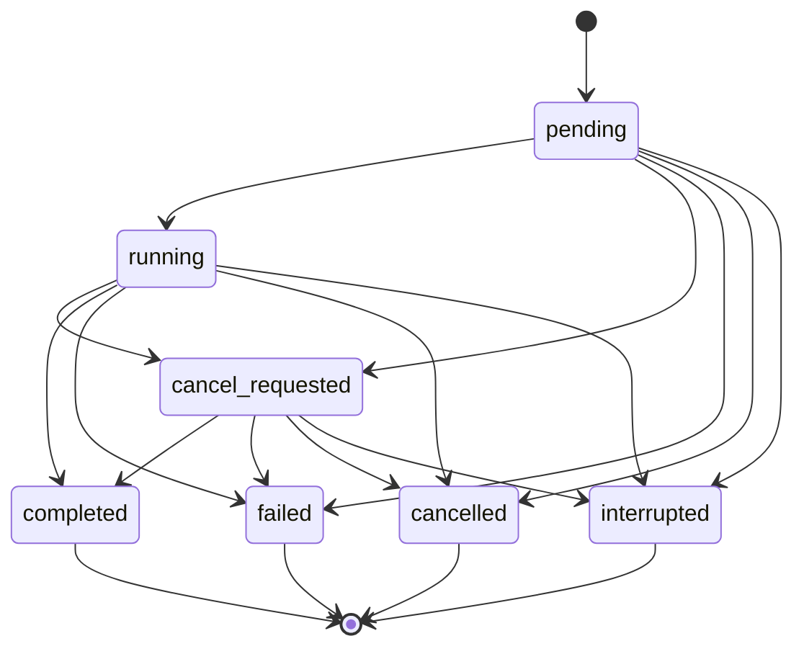

# Chat Core

> 代码源头：`packages/contracts/src/chat.ts`、`packages/chat/src/model.ts`、`packages/chat/src/ports.ts`、`packages/chat/src/run-state-machine.ts`、`packages/chat/src/service.ts`
> 状态：领域契约、模型、ports、service、run 状态机、PostgreSQL schema 与初始 migration 已实现；repository adapter 仍在 Goal 1 后续功能中实现。

## 边界

`@repo/chat` 是领域与应用层，不依赖 Next.js、AI SDK、Drizzle、Redis、Trigger 或 provider SDK。调用入口负责注入 `ChatRepository`、`Clock` 和 `IdGenerator`；模型执行、路由、计费、文件与工具将在后续 Goal 通过新的 ports 接入。

`@repo/contracts` 保存需要跨 Web、领域、数据库和任务边界稳定传输的值：品牌 ID、版本化 `MessageContent`、run/message 状态、重要事件、usage 与净化后的失败结构。它不保存 AI SDK `UIMessage` 或 provider 对象。

## 消息内容

`MessageContent` 第一版固定为 `{ version: 1, parts: [...] }`，当前允许：

- `text`
- `reasoning` summary/hidden
- `source-url`
- `file`
- `tool`

新 part 必须先更新 Zod discriminated union，再更新数据库快照兼容、前端 renderer 和迁移/回填策略。用户输入在 service 边界校验；JSON 数据只允许有限 JSON 值，不接受函数、类实例或 `undefined`。

## 原子 turn

`ChatService.prepareRun()` 只构造一次 repository 命令，目标 adapter 必须在一个事务内：

1. 校验 conversation 属于 owner。
2. 校验 parent 属于同一 conversation。
3. 创建 completed user message。
4. 创建 pending assistant placeholder，parent 指向 user message。
5. 创建 pending run 并关联两条消息。
6. 写入 sequence 1 的 `run.created` 重要事件。
7. 把 conversation active leaf 指向 assistant placeholder。

`(ownerId, clientRunId)` 唯一。重复命令返回原有三项记录且 `created=false`，不得创建新消息或新 run。

## Run 状态机

`cancel_requested -> completed` 是刻意允许的竞态：模型可能在取消请求被执行前已经完成。四个 terminal 状态不可退出；相同状态不是合法转换。assistant message 状态随 run 同步为 pending、streaming 或相应终态。

## Checkpoint 与并发

运行中的 assistant checkpoint 使用 run `version` 乐观并发。每次成功 checkpoint 原子更新消息内容、usage、version、`lastEventSequence` 并写 `message.checkpoint`；版本不一致返回 `concurrent_run_update`，调用者重新读取后决定重试。PostgreSQL 保存重要 checkpoint/event，不永久保存每个 token delta。

## PostgreSQL schema

已实现四张事实表：

- `conversations`：owner、title、archive 和 active leaf。
- `messages`：版本化 content、role/status、branch reason 与同会话 parent 树。
- `chat_runs`：owner-scoped `clientRunId` 幂等、两条消息关联、状态、version、sequence、usage/failure/route snapshot。
- `chat_run_events`：每个 run 内严格唯一的正整数 sequence 与重要事件 JSON。

数据库用 check 约束稳定枚举和长度，用复合外键禁止跨 conversation 消息父子关系、跨 conversation run 消息和跨 owner run，用 `ON DELETE SET NULL` 处理 active leaf，用 `RESTRICT` 保留仍被 run 或子消息引用的事实。初始 migration 通过 PGlite 的 PostgreSQL 内核从零执行并验证约束；生产数据库只允许显式运行版本化 migration。

## 当前未实现

- 真实 PostgreSQL repository adapter。
- AI SDK stream、模型路由、usage normalization 和 provider trace。
- Redis 完整短期 event replay、cancel flag 与跨实例 tail。
- 身份/权限、计费、附件所有权、Route Handler 和聊天 UI。

这些能力属于后续原子功能/Goal，不能因为 contract 存在而标记为已实现。
