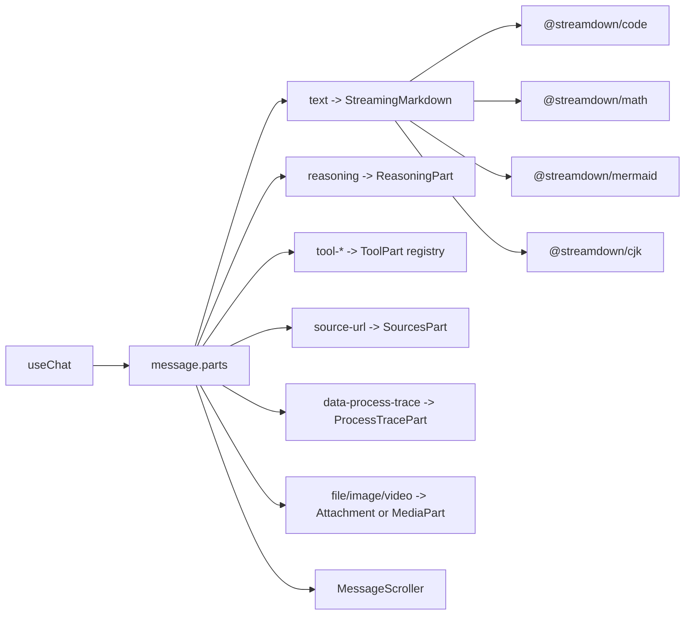

# Frontend Stack Baseline

> 代码源头：`packages/design-system/src/components/message-scroller.tsx`、`packages/design-system/src/components/streaming-markdown.tsx`
> 状态：前端基础依赖、最薄聊天页面、AI SDK 状态接线、持久 checkpoint 传输、刷新恢复与 viewport-fluid 页面尺度已实现；工具、文件和媒体 part 仍为规划。
> 审计日期：2026-08-13。

## 1. 目标

Chat 的前端需要同时满足三类需求：

- 普通聊天保持轻量、首 token 快、刷新行为可解释。
- 支持文本、思考、工具、来源、附件、图片和视频等结构化消息 parts。
- 用户端、设置和管理后台共享一套紧凑、可访问、可维护的组件系统。

选型组合以最新 `shadcn-ui/chatbot-template` 的消息结构和滚动行为为外壳，以 DEEIX 已验证的 Streamdown 渲染路线为能力参考，不复制 DEEIX 的大型单体组件。

## 2. 已锁定的技术基线

| 层级 | 选择 | 当前状态 |
| --- | --- | --- |
| 框架 | Next.js 16 App Router、React 19、TypeScript 7 | 已实现 |
| 样式 | Tailwind CSS v4、Lerpwind viewport-fluid 尺度、语义 token | 已实现 |
| UI source | shadcn/ui Base Rhea + Base UI | 已实现 |
| Chat primitive | shadcn Message、Bubble、Attachment、Marker | 已实现 |
| 滚动行为 | `@shadcn/react/message-scroller` | 已实现 |
| AI UI state | AI SDK 7 + `@ai-sdk/react` 4 `useChat` | 已实现 |
| Markdown | Streamdown 2 + CJK、Math、Code、Mermaid plugins | 已接入 assistant 文本 |
| 流协议 | 领域 checkpoint SSE → 自定义 AI SDK `ChatTransport` → `UIMessageChunk` | 已实现 |
| 表单 contract | Zod 4；复杂表单再引入 React Hook Form | 聊天边界已实现 |
| 主题/通知/i18n | `next-themes`、Sonner、`next-intl` | 规划，按功能引入 |

Rhea 用于紧凑、信息密度高的聊天工作区与管理后台。`components.json` 的 `style`、`baseColor`、`iconLibrary` 和 base 必须在 Web 与 design-system workspace 保持一致。

Web 样式入口通过 Lerpwind 的 Tailwind v4 插件把首页、认证页和聊天工作区的关键 padding、gap 与字号写成 `@apply @…`。全局插值范围为 20rem–80rem；颜色、组件状态和语义圆角事实仍由 design-system token 管理，不让流式插件越过页面布局边界。

## 3. 消息渲染结构

`ChatUIMessage` 使用 AI SDK `UIMessage` 的 typed metadata、data parts 和 tool parts。页面按 `part.type` 显式委派到小组件，不建立一个吞掉全部消息类型的万能 renderer。

首批 part 约定：

| Part | 渲染责任 |
| --- | --- |
| `text` | 已实现；assistant 使用 `StreamingMarkdown`，用户消息保持纯文本 |
| `reasoning` | 已实现只读折叠摘要；不假定供应商会暴露完整思维链 |
| `tool-*` | 按工具名和 state 渲染 input streaming、待批准、执行、结果和错误 |
| `source-url` | 已实现安全文本标签；外链确认交互待实现，不依赖模型手写脚注解析 |
| `file` / media data part | 附件卡、图片、音频和视频专用组件 |
| `data-process-trace` | 文件预处理、RAG、上下文压缩等平台处理轨迹 |

用户消息默认按纯文本展示；需要 Markdown 编辑预览时再显式开启，避免把任意用户输入直接当成富文本。

## 4. Streamdown 边界

`StreamingMarkdown` 是通用 AI 文本 renderer，不知道 conversation、tool、billing 或数据库状态。

已实现约束：

- CJK 与数学插件作为基础能力。
- 检测到 fenced code 时动态加载 Shiki code plugin。
- 检测到 Mermaid block 时动态加载 Mermaid plugin。
- Mermaid 使用 `securityLevel: strict` 和 `htmlLabels: false`。
- 显式排除 raw HTML rehype plugin，只保留 sanitize 与 harden。
- 流式时启用 incomplete Markdown 修复和 caret；静态历史使用 static mode。
- Streamdown、插件和 KaTeX 的 Tailwind source/CSS 由 design-system 统一提供。

后续约束：

- 外链统一经过确认组件或 URL policy。
- AI 生成 HTML visual 不进入 Markdown renderer；未来放入独立 sandbox/iframe，并采用单独白名单。
- 图片、视频和下载地址优先由结构化 part 提供，不把签名 URL 作为 Markdown 事实源。
- 插件错误只降级对应 block，不让整条消息消失。

## 5. 滚动与长会话

`MessageScroller` 只负责滚动，不持有消息、模型、传输或持久化：

- 使用稳定 `messageId` 包裹每一行。
- 用户消息或 turn marker 作为 `scrollAnchor`。
- 只有读者位于 live edge 时才跟随流式输出。
- 用户向上阅读后停止自动跟随，通过按钮恢复。
- 历史分页前插时保留当前可见位置。
- `content-visibility` 作为首阶段长列表优化。

第一阶段不引入虚拟列表。真实会话达到数千行并经性能测试确认后，才让 TanStack Virtual 接管 rows，继续复用 MessageScroller viewport。

## 6. 传输与状态

- Client 使用 `useChat<ChatUIMessage>`，但不使用 `DefaultChatTransport`。`DurableChatTransport` 依次创建 conversation/run、订阅领域 checkpoint SSE，并转换为 AI SDK `UIMessageChunk`。
- Browser 只提交最后一条用户消息、持久 parent message id、稳定 `clientRunId` 和当前模型 key；Server 从 PostgreSQL 重新加载、校验并固定历史与 route。
- 公共 JSON response 先经 Zod 校验；SSE `snapshot` 再经同一套公开 resource schema 校验。checkpoint 若不是既有文本的前缀追加，Client fail closed，避免刷新后静默重复或改写文本。
- `UIMessage` 只保存浏览器渲染状态。领域 message、run、event、usage 和后续 billing facts 仍以 PostgreSQL 为准。
- 首次创建 conversation 后使用 `history.replaceState` 写入 `/chat/:conversationId`；刷新和分享当前浏览器地址都能重新装载 owner-scoped snapshot。
- 不使用 WebSocket 承载首版普通聊天；SSE 足以覆盖单向 token/event stream。
- 不引入全局状态库；Server Component、URL state、`useChat` 和局部 React state 优先。

选择自定义 transport 是领域边界决策：服务端已经有可幂等、可取消、可审计的 durable run 协议，不能让 AI SDK 的一次 HTTP response 成为运行事实源。AI SDK 继续负责标准消息状态与流式 UI，transport 只做协议适配。

## 7. 刷新、恢复与停止

| Profile | 刷新行为 |
| --- | --- |
| Vercel Core / Docker | Server 加载已持久化 branch 和 `activeRun`；`useChat({ resume: true })` 从 assistant baseline 重新订阅 PostgreSQL checkpoint cursor |
| 后续 Redis profile | 保留相同 snapshot/cursor contract，以 pub/sub 或 resumable stream 降低轮询和 checkpoint 延迟 |

刷新、断网和路由跳转只断开浏览器订阅，不取消服务端 run。页面重载以已有 assistant 文本作为 baseline，再只追加新 checkpoint；同一 run 完成后保留一个 assistant message，不复制内容。显式“停止生成”调用独立 cancel endpoint，先持久 `cancel_requested`，再由执行器收敛 partial assistant snapshot 和终态。客户端断流不能替代服务端取消，也不要求 Trigger.dev。

当前没有 durable queue；如果 Vercel 实例在 `after()` 执行期间硬终止，僵尸 run 的 lease/reaper 与重新领取仍是后续工作。

## 8. 依赖引入纪律

首阶段已加入：

- `@ai-sdk/react`
- `ai`（自定义 `ChatTransport` 与 `UIMessageChunk` 的直接类型/协议依赖）
- `@shadcn/react`
- `streamdown`
- `@streamdown/code`、`@streamdown/math`、`@streamdown/mermaid`、`@streamdown/cjk`
- `katex`、`lucide-react`

按功能延后：

- `next-themes`、Sonner、`next-intl`
- React Hook Form
- Recharts、Monaco、PDF.js、docx-preview、dnd-kit、Motion
- TanStack Virtual

不采用为基础依赖：

- `react-markdown`：适合最小模板，但不作为流式主 renderer。
- AI Elements：当前不作为 Base UI 项目的基础层；可参考交互，避免引入 Radix-only API。
- Zustand/Redux：没有跨页面客户端事实源前不引入。
- WebSocket：没有真正双向实时需求前不引入。

## 9. 与参考实现的关系

| 参考 | 采用 | 有意差异 |
| --- | --- | --- |
| `shadcn-ui/chatbot-template` | Rhea、Base UI、typed message parts、MessageScroller、显式 part renderer | 文本不用 `react-markdown + typeset`，改用 Streamdown |
| DEEIX | Streamdown plugins、处理/思考/工具分层、媒体独立渲染 | 不复制混合 Radix/Base UI 和大型单体 renderer |

## 10. 官方资料

- [shadcn Chatbot Template](https://github.com/shadcn-ui/chatbot-template)
- [shadcn Message Scroller](https://ui.shadcn.com/docs/components/base/message-scroller)
- [shadcn Rhea](https://ui.shadcn.com/docs/changelog/2026-05-rhea)
- [Streamdown](https://github.com/vercel/streamdown)
- [AI SDK Chatbot](https://ai-sdk.dev/docs/ai-sdk-ui/chatbot)
- [AI SDK Message Persistence](https://ai-sdk.dev/docs/ai-sdk-ui/chatbot-message-persistence)
- [AI SDK Resume Streams](https://ai-sdk.dev/docs/ai-sdk-ui/chatbot-resume-streams)
