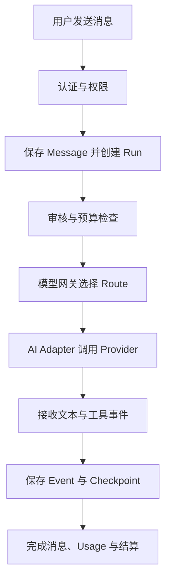
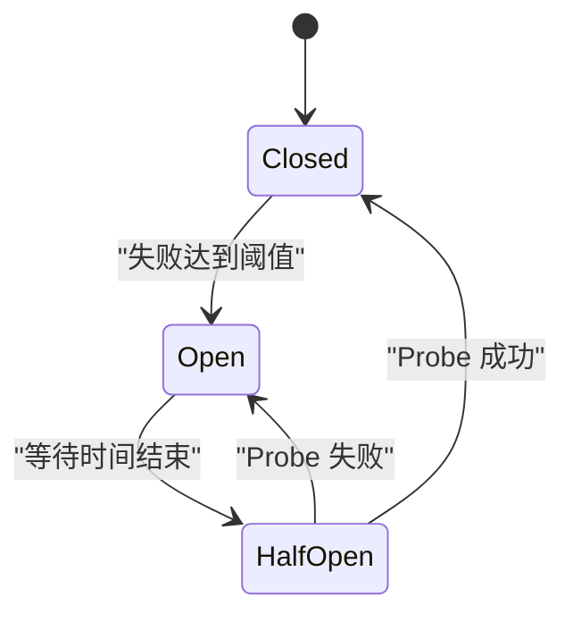
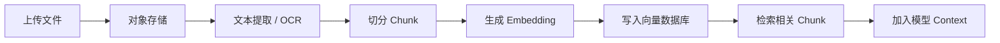

# DEEIX Chat 概念手册：写给 API 与 Chatbot 初学者

> 读者：第一次接触 API、LLM 应用、模型网关和后台系统的产品或开发同学。  
> DEEIX 事实来源：[`DEEIX_FEATURE_INVENTORY.zh-CN.md`](../DEEIX_FEATURE_INVENTORY.zh-CN.md)，审计基线为 `dev@2753b98`、产品版本 `0.3.4`。  
> Chat 目标方案：[`DEEIX_REIMPLEMENTATION_ARCHITECTURE.zh-CN.md`](../DEEIX_REIMPLEMENTATION_ARCHITECTURE.zh-CN.md)。  
> 当前状态：Chat 已完成 Goal 1、Goal 2；Goal 3 完整模型网关是下一阶段。文件、RAG、MCP、计费、媒体和管理后台仍是规划，详见 [`implementation-goals.md`](../architecture/implementation-goals.md)。

## 1. 先建立一张地图

DEEIX Chat 由多组能力共同完成一次聊天：

```text
聊天产品
  ├─ 账号、身份与权限
  ├─ Conversation、Message 与分支
  ├─ 模型目录、路由与网关
  ├─ Chat Run、流式事件与恢复
  ├─ 文件、RAG 与长期记忆
  ├─ MCP 与模型原生工具
  ├─ 计费、支付与内容审核
  └─ 数据库、缓存、存储与运维
```

用户看到的是一个聊天界面。服务器内部需要确认用户身份、保存消息、选择模型线路、调用外部 API、持续传输结果、处理工具和文件，最后记录用量与执行状态。



其中认证、聊天事实、单 Route 调用、Checkpoint 和最薄聊天界面已在当前 Chat 实现；审核、预算、完整多 Route 网关和后续能力应按 Goal 状态理解。

## 2. API 与 Chatbot 基础

### 2.1 Chatbot、大模型与 API

| 概念 | 含义 |
| --- | --- |
| Chatbot | 用户使用的完整聊天产品，包括界面、账号、历史消息、文件、模型调用和设置。 |
| 大模型 / LLM | 负责生成文字、推理步骤或工具指令的模型，例如 GPT、Claude、Gemini。 |
| API | 两个程序之间约定的通信方式。调用方按规定发送数据，服务方按规定返回结果。 |
| SDK | 对 API 的代码封装，帮助开发者少写底层 HTTP 代码。 |
| Endpoint | 一个具体 API 地址，例如 `/v1/responses`。 |
| Base URL | 一组 Endpoint 共同的地址前缀，例如 `https://api.openai.com`。 |
| JSON | API 常用的数据格式，由对象、数组、字符串、数字等组成。 |
| Header | 请求的附加信息，例如身份凭证、内容类型和 Trace ID。 |
| Body | 请求或响应的主要数据。 |
| API Key | 程序调用模型服务的密钥。它属于服务端 Secret，不能发给浏览器。 |
| Timeout | 等待超过规定时间后终止本次请求。 |
| Streaming | 模型生成一小段就返回一小段，用户不必等待完整回答。 |

Chatbot 不等于模型。模型只负责生成；Chatbot 还要保存业务数据、处理权限、连接工具并向用户提供稳定界面。

### 2.2 常见 HTTP 状态

| 状态 | 常见含义 |
| --- | --- |
| `2xx` | 请求成功。 |
| `400` | 参数或请求格式错误。 |
| `401` | 没有有效身份。 |
| `403` | 已登录，但没有执行该操作的权限。 |
| `404` | 请求的资源不存在。 |
| `409` | 当前请求与已有状态冲突。 |
| `429` | 请求过多，上游正在限流。 |
| `5xx` | 服务端或上游发生故障。 |

网络错误、超时和 `5xx` 可能适合重试或切换线路；权限错误、参数错误和余额不足通常不应换线路重做。

## 3. 模型与上下文

### 3.1 Model、Provider、Vendor 与 Upstream

| 概念 | 含义 |
| --- | --- |
| Model | 具体模型，例如某个版本的 Claude Sonnet。 |
| Model ID | 上游 API 使用的真实模型名称。 |
| Vendor | 面向用户展示的品牌，例如 OpenAI、Anthropic、Google。 |
| Provider | 程序需要按照哪一类服务商规则调用模型。 |
| Upstream | 一套真实服务连接，包含 Base URL、API Key、Header、超时和协议默认值。 |

同一个 Vendor 可以通过官方 API、OpenRouter 或公司内部代理提供。它们的展示品牌可能相同，但属于不同 Upstream。

### 3.2 Prompt、Token 与 Context

| 概念 | 含义 |
| --- | --- |
| Prompt | 给模型的问题或指令。 |
| System Prompt | 平台放在最前面的规则，例如「你是客服助手」。 |
| User Message | 用户输入。 |
| Assistant Message | 模型生成的回答。 |
| Token | 模型读取和生成内容的计量单位，不完全等于字数。 |
| Context | 本次发给模型的全部信息。 |
| Context Window | 模型单次最多能处理的 Token 数量。 |
| Temperature | 控制输出随机程度的参数。 |
| Max Output Tokens | 限制本次最多生成多少 Token。 |
| Reasoning | 模型用于推理的内容或用量。是否展示、保存或回传下一轮需要单独制定策略。 |

一次 Context 可能包含 System Prompt、当前消息分支、文件片段、RAG 结果、长期记忆、Skill 和工具定义。数据库里存在的信息不会自动被模型看到，必须由服务端选择后放入 Context。

### 3.3 Context Compression

长对话可能超过 Context Window。Context Compression 会把较早的内容总结成短文本，再与最近消息组合。

压缩可以减少 Token，但摘要可能遗漏细节，因此压缩结果应作为独立记录保存，不能覆盖原始 Message。

## 4. Conversation、Message 与 Chat Run

### 4.1 三个核心对象

| 概念 | 含义 |
| --- | --- |
| Conversation | 一整个对话。 |
| Message | 对话中的一条用户或助手消息。 |
| Run | 为生成一次助手回答而进行的一次执行。 |
| Event | Run 执行过程中产生的文本、工具、状态或错误事件。 |
| Checkpoint | 已持久化的中间进度。 |

Message 是用户最终看到的业务事实；Run 记录生成过程。一次 Message 可以因为重新生成、失败恢复等原因关联不同执行记录。

### 4.2 Assistant Placeholder

用户发送消息时，服务端先原子创建：

1. 用户 Message；
2. 空的助手 Message；
3. Run。

随后模型输出逐步写入助手 Message 或 Checkpoint。即使生成失败，数据库仍能解释本次操作发生了什么。

### 4.3 消息分支

编辑历史消息或重新生成回答时，系统创建新分支，不覆盖原内容：

```text
用户问题
  ├─ 回答 A
  └─ 回答 B（重新生成）
```

下一轮 Context 只沿当前分支的父消息向上构建，不能混入兄弟分支。

### 4.4 Prompt Preset、Skill、Memory、Tool 与 Artifact

| 概念 | 含义 |
| --- | --- |
| Prompt Preset | 可以重复插入的 Prompt 模板。 |
| Skill | 一份结构化工作说明，作为模型上下文使用。 |
| Memory | 保存的用户事实或偏好。 |
| Tool | 模型可以请求服务器实际执行的功能。 |
| Artifact | 独立于普通文本展示的制品，例如 HTML、图片、视频或可下载文件。 |

DEEIX Skill 是提示上下文，不会因为 `SKILL.md` 中出现命令就直接在服务器执行命令。

## 5. 模型网关

模型网关位于 Chatbot 与模型服务之间：

```text
Chatbot
  → Model Gateway
      → OpenAI
      → Anthropic
      → Google
      → OpenRouter
      → 自建 OpenAI-compatible 服务
```

它负责：

1. 管理用户可见的模型目录；
2. 选择本次请求使用的真实线路；
3. 转换不同 Provider 的 API 协议；
4. 处理权重、故障转移、限流和熔断；
5. 统一错误、Usage、价格和调试信息。

普通 API Gateway 通常负责 HTTP 路由、认证、限流和访问日志；Model Gateway 还必须理解模型能力、协议、流式输出、Tool Calling、Usage 和多上游策略。

## 6. DEEIX 四层模型目录

```text
Platform Model
  → Platform Model Route
      → Upstream Model Binding
          → Upstream
```

### 6.1 Platform Model

用户在模型选择器中看到的稳定模型。它保存展示名称、描述、能力、系统 Prompt、可见性和权限等产品信息。

Platform Model 不必固定对应一个真实 API 模型。

### 6.2 Upstream

一套真实服务连接配置，包括：

- Base URL；
- API Key 或 Key Pool；
- 自定义 Header；
- 超时；
- Provider 类型；
- 默认协议；
- 上游级熔断策略。

### 6.3 Upstream Model Binding

表示某个 Upstream 中实际存在的模型，例如：

```text
Upstream：OpenRouter
Model ID：anthropic/claude-sonnet
Protocol：OpenAI Chat Completions
```

### 6.4 Platform Model Route

Route 把一个 Platform Model 连接到一个 Binding，并保存优先级、权重、启停状态和覆盖配置。

```text
Claude Sonnet
  ├─ Route A：Anthropic 官方，priority 1，weight 70
  ├─ Route B：OpenRouter，priority 1，weight 30
  └─ Route C：备用代理，priority 2
```

### 6.5 Resolver

Resolver 是选择 Route 的算法。它先排除：

- 用户无权限的模型；
- 类型或能力不匹配的 Route；
- 已停用的对象；
- 协议不支持的 Binding；
- 正在限流或熔断的线路。

然后按 Priority 和 Weight 选出本次 Route。

## 7. Protocol、Adapter 与 Canonical Data

### 7.1 Protocol

不同厂商的 API 格式不同，例如：

- OpenAI Responses；
- OpenAI Chat Completions；
- Anthropic Messages；
- Google Generate Content；
- xAI Responses。

同一组聊天消息在不同协议中可能使用完全不同的 JSON 字段和流事件。

### 7.2 Adapter

Adapter 把平台统一请求翻译成 Provider 请求，再把 Provider 返回内容转换成平台统一结果。

```text
Canonical Request
  → Anthropic Adapter
  → Anthropic Messages API
  → Anthropic Stream
  → Canonical Event
```

### 7.3 Canonical Protocol

Canonical Protocol 是平台内部统一的数据表达，包括：

- Message；
- Tool；
- Stream Event；
- Usage；
- Error。

它让 Chat Engine 不需要理解每个厂商的特殊字段。

### 7.4 当前 Chat package 分工

| Package | 职责 |
| --- | --- |
| `@repo/model-router` | 管理四层目录并选择 Route。 |
| `@repo/ai` | 按 Route 调用 Provider，并转换输入、事件和 Usage。 |
| `@repo/chat-engine` | 编排聊天事实、Route、Secret、AI Stream 与 Checkpoint。 |
| `@repo/chat` | 保存与基础设施无关的聊天领域规则。 |

## 8. Priority、Weight、Retry 与 Failover

### 8.1 Priority

Priority 决定先使用哪一组 Route。数字越小，优先级越高。只有当前优先级组没有可用线路时，才进入下一组。

### 8.2 Weight

Weight 决定同一优先级内的相对选择概率。`70:30` 表示长期分布倾向，不保证任意连续 100 次请求严格等于 70 次和 30 次。

### 8.3 Retry

Retry 通常表示在同一线路重新尝试。例如瞬时网络断开后，再请求同一个 Upstream。

### 8.4 Failover

Failover 表示当前 Route 失败后改用另一条 Route。

以下情况通常可以考虑 Failover：

- 连接错误；
- 超时；
- `429`；
- 上游 `5xx`；
- 尚未输出可见内容时的上游故障。

以下情况通常不能自动 Failover：

- 用户主动取消；
- 参数或权限错误；
- 已经向用户输出可见文本；
- 工具已经产生外部副作用；
- 上游可能已经接受计费或媒体任务。

### 8.5 Backoff

Backoff 是失败后逐渐延长等待时间，例如 `5s → 10s → 20s`。它常用于 `429`，避免系统继续快速冲击正在限流的服务。

## 9. Circuit Breaker：熔断

熔断用于暂时停止请求持续故障的线路。



### 9.1 Closed

熔断器关闭，线路正常接收请求。这里的「关闭」表示没有切断线路。

### 9.2 Open

失败达到阈值后，熔断器打开。Resolver 在一段时间内直接跳过这条线路，不再浪费请求和等待时间。

### 9.3 Half-open

等待结束后只放行少量 Probe。Probe 成功则恢复 Closed，失败则重新 Open。

### 9.4 两级 Circuit

- Binding 级 Circuit：某个具体上游模型出现故障；
- Upstream 级 Circuit：整个服务商或代理出现大面积故障。

多个 Binding 连续故障可能触发 Upstream 级熔断。

### 9.5 Probe

Probe 是轻量测试请求，用于检查配置、协议、延迟和恢复状态。它不应写入普通聊天记录，也不应改变业务账单；上游仍可能对测试调用计费。

### 9.6 相近概念对比

| 概念 | 作用 |
| --- | --- |
| Retry | 同一线路再试。 |
| Failover | 换另一条线路。 |
| Backoff | 延长下一次尝试前的等待。 |
| Circuit Breaker | 持续故障后暂时停止尝试。 |
| Probe | 检查线路是否可用或已经恢复。 |

## 10. Chat Run、Stream 与恢复

### 10.1 Run 生命周期

```text
created
  → running
      → completed
      → failed
      → cancelled
```

Run 关联用户 Message、助手 Message、Route Snapshot、Usage、事件、错误和 Checkpoint。

### 10.2 Delta、Event 与 Sequence

模型流式返回的一小段文本叫 Delta。除了文本，Run 还可能产生 reasoning、RAG、Tool、Usage、completed 和 error Event。

每个 Event 使用递增 Sequence：

```text
1, 2, 3, 4...
```

客户端刷新后可以携带最后收到的 Sequence，只请求后续事件。

### 10.3 Checkpoint

Checkpoint 保存阶段性事实，例如：

- 已生成的助手文本；
- 最后事件位置；
- Run 状态；
- 当前 Usage。

它支持页面恢复和执行状态核对，但不意味着模型进程崩溃后可以从上一个 Token 精确续算。

### 10.4 Disconnect 与 Cancel

- Disconnect：浏览器断网、刷新或关闭页面；
- Cancel：用户明确点击停止生成。

浏览器连接不拥有 Run 生命周期。连接断开不等于取消；服务端 Run 可以继续执行。显式 Cancel 才应终止模型调用并收敛到 `cancelled`。

### 10.5 Lease

Lease 是一段短期执行所有权。执行器定期续约；长时间不续约时，系统可以判断执行进程可能已经失效。

## 11. Event Stream、Queue 与 Worker

| 概念 | 含义 |
| --- | --- |
| Event Stream | 保存已经产生的 Run Event，供客户端订阅和重放。 |
| 浏览器消息队列 | 当前回复未结束时，浏览器临时保存后续输入。只在内存中时刷新会丢失。 |
| Job Queue | 保存等待后台执行的任务。 |
| Worker | 从 Job Queue 获取任务并执行。 |
| Durable Job | 服务重启后仍可恢复、重试或继续处理的任务。 |
| DLQ | 多次失败后保存任务的死信队列。 |

Redis Stream 可以保存聊天 Event，但保存 Event 不等于执行模型任务。真正的 Job Queue 还要负责领取、重试、超时、并发和失败处理。

### 11.1 JobDriver

JobDriver 是后台任务实现的统一接口。目标方案允许：

| 实现 | 适用场景 |
| --- | --- |
| Trigger.dev | Vercel Full 的持久后台任务。 |
| BullMQ | Docker Full 中基于 Redis 的 Worker。 |
| Inline | 轻量、短时任务；进程重启后不可靠。 |

普通文本聊天不需要默认进入 Job Queue；文件解析、OCR、Embedding、视频轮询和批量导出更适合后台任务。

## 12. 文件、Embedding 与 RAG



### 12.1 Object Storage

PDF、图片和视频等大文件通常放在 S3、R2、Vercel Blob、MinIO 或本地文件系统。数据库保存所有者、大小、Hash、状态和 Object Key。

### 12.2 MIME、Hash 与去重

- MIME 描述真实文件类型，例如 `application/pdf`；
- Hash 是根据文件内容计算的标识；
- 相同 Hash 可以帮助识别重复文件。

服务器不能只相信扩展名，还要限制 MIME、文件大小、数量和所有权。

### 12.3 Extraction 与 OCR

- Extraction：从 PDF、Word、Excel 等文件中提取机器可读文本；
- OCR：识别图片中的文字。

DEEIX 可配置 Tika、Docling、MinerU、RapidOCR、Tesseract 等处理方式。

### 12.4 Chunk

长文档需要切成较小片段，每个片段称为 Chunk。Chunk 太大可能浪费 Context，太小则可能丢失上下文关系。

### 12.5 Embedding 与 Vector Database

Embedding 把文字转换成数字向量。语义接近的文本，其向量通常也更接近。

Vector Database 用于快速检索相似向量。DEEIX 使用 PostgreSQL + pgvector 或 SQLite + sqlite-vec。

### 12.6 Top K 与 Threshold

- Top K：最多取回多少个结果；
- Threshold：结果必须达到的最低相似度。

结果过多会浪费 Token，阈值过低会把无关内容放进 Context。

### 12.7 BM25、Hybrid Search 与 RRF

- BM25：按关键词匹配，适合编号、专名和精确词语；
- Vector Search：按语义相似度匹配；
- Hybrid Search：同时使用关键词和向量检索；
- RRF：根据多套排名位置合并结果。

### 12.8 Full、RAG 与 Reindex

- Full：把文件全文放入 Context；
- RAG：只放检索到的片段；
- Auto：根据文件和策略自动选择；
- Reindex：Chunk 或 Embedding 规则变化后重新处理已有数据。

## 13. Tool、MCP 与原生工具

### 13.1 Tool Calling

模型返回工具名和参数，服务器校验并执行，再把结果交还模型：

```text
模型请求 Tool
  → 参数 Schema 校验
  → 服务器执行
  → 返回 Tool Result
  → 模型生成最终回答
```

### 13.2 Tool Schema 与 Tool Loop

Tool Schema 描述名称、参数类型和必填字段。一次回答可能多轮调用工具，因此必须限制最大循环次数、总调用数、并发和结果大小。

### 13.3 MCP

MCP 是 AI 应用发现和调用外部工具的标准协议：

```text
DEEIX MCP Client
  → MCP Server
      → tools/list
      → tools/call
```

MCP Server 可以连接 GitHub、Notion、数据库、搜索服务或公司内部系统。

### 13.4 Provider-native Tool

模型厂商原生工具由 Provider 执行，例如 Web Search 或 Code Interpreter。

| 类型 | 执行位置 |
| --- | --- |
| MCP Tool | DEEIX 连接 MCP Server 执行。 |
| Provider-native Tool | 模型 Provider 执行。 |
| Skill | 只进入 Prompt Context，不直接执行。 |

### 13.5 Side Effect

发送邮件、删除文件、创建订单和修改数据库会改变外部状态，称为 Side Effect。发生 Side Effect 后不能自动重放整个 Run，否则可能执行两次。

## 14. Usage 与计费

### 14.1 Usage

Usage 可能包含：

- Input Token；
- Output Token；
- Reasoning Token；
- Cache Read / Write；
- Tool Call；
- 图片数量；
- 视频时长。

Usage Normalizer 把不同 Provider 的字段转换成平台统一格式。

### 14.2 Reservation

生成开始前预占预算，完成后按真实 Usage 结算：

```text
余额 10 元
  → 预占 2 元
  → 实际使用 0.8 元
  → 扣除 0.8 元并释放 1.2 元
```

Reservation 可以减少多请求并发透支。

### 14.3 Settlement、Ledger 与 Reconciliation

| 概念 | 含义 |
| --- | --- |
| Settlement | Run 完成后按真实 Usage 结算。 |
| Ledger | 保存模型、Route、Usage、价格、折扣和余额变化的账本。 |
| Price Snapshot | 保存调用发生时的价格，避免以后改价影响历史账单。 |
| Reconciliation | 检查崩溃或超时留下的异常 Reservation，并释放或结算。 |

### 14.4 Idempotency

Idempotency 表示同一个业务请求重复提交，最终只产生一次结果。它用于 Chat Run、支付 Webhook、后台任务和媒体生成。

### 14.5 Money

金额不能使用普通浮点数作为最终事实。系统应使用最小货币单位整数或高精度 Decimal，避免 `0.1 + 0.2` 的精度误差。

## 15. 认证、权限与安全

### 15.1 Authentication 与 Authorization

- Authentication：确认用户是谁；
- Authorization：确认用户可以做什么。

登录成功不代表可以使用全部模型或进入管理后台。

### 15.2 Session、Access Token 与 Refresh Token

| 概念 | 含义 |
| --- | --- |
| Session | 一次登录状态，关联用户、设备、过期时间等信息。 |
| Access Token | 短期访问凭证。 |
| Refresh Token | 用于换取新 Access Token 的长期凭证。 |
| HttpOnly Cookie | 浏览器 JavaScript 不能直接读取的 Cookie，可降低令牌被脚本窃取的风险。 |

### 15.3 OAuth、OIDC、SSO 与 2FA

- OAuth：授权第三方应用访问资源；
- OIDC：在 OAuth 之上增加身份登录；
- SSO：使用统一身份系统登录多个应用；
- PKCE：保护 OAuth 授权码流程；
- 2FA：密码之外再增加一项验证；
- TOTP：认证器按时间生成的一次性验证码。

### 15.4 RBAC 与 ABAC

- RBAC：根据角色授权，例如管理员和普通用户；
- ABAC：根据用户、模型、Vendor、Protocol、订阅等属性匹配规则。

DEEIX 的权限组和自动模型访问规则结合了这两类思路。

### 15.5 Hash 与 Encryption

- Hash 是单向转换，适合保存密码；
- Encryption 可以解密，适合保存调用上游时必须取回的 API Key。

密码不能明文保存，API Key 也不能直接持久化或发送给浏览器。

### 15.6 SSRF 与 DNS Rebinding

SSRF 是攻击者诱导服务器访问内网、回环地址或云元数据服务。DNS Rebinding 则让同一域名在检查后解析到新的危险地址。

外部 URL、MCP Endpoint 和模型制品下载需要检查：

- URL 协议；
- 解析后的 IP；
- 每次 Redirect；
- 私网、回环和链路本地地址；
- 响应大小和超时。

当前 Chat 已有共享 `@repo/network-security` URL/DNS 策略和连接时 pinned lookup；MCP 与媒体业务规则仍在后续 Goal。

### 15.7 Rate Limit、CORS 与 Moderation

- Rate Limit：限制一定时间内的请求次数；
- CORS：限制哪些网页 Origin 可以调用 API；
- Moderation：审核输入/输出文字和图片，并按策略允许、标记或拦截。

内容审核属于后续 Goal，不能把模型自身的安全拒绝当作完整平台审核系统。

## 16. 数据库、缓存与存储

### 16.1 Database、Schema 与 Migration

Database 保存用户、Conversation、Message、Run、Route、Usage 和权限等结构化事实。

- Schema：表、字段、索引和约束；
- Migration：数据库结构的版本化变更；
- Transaction：多个操作一起成功或一起失败；
- Unique Constraint：阻止重复业务事实；
- CAS：只在版本或状态仍符合预期时更新，避免并发覆盖。

当前 Chat 使用 PostgreSQL、Drizzle 和版本化 Migration，不在 Web 冷启动时自动修改数据库。

### 16.2 PostgreSQL 与 SQLite

| 数据库 | 适用范围 |
| --- | --- |
| PostgreSQL | 生产、多用户、多实例和完整向量能力。 |
| SQLite | 个人、单进程和轻量部署。 |

PostgreSQL 是当前 Chat 的生产主线；SQLite Lite Profile 属于后续目标。

### 16.3 Cache、Redis 与 Memory

Cache 保存可重新计算但希望快速读取的数据。Redis 还可以承担限流、熔断状态、锁、Event Stream 和 Job Queue。

Memory Adapter 只保存在当前进程；程序重启会丢失，也不能支撑多实例共享状态。

### 16.4 Object Store

Object Store 保存文件和媒体字节，数据库保存元数据和所有权。Vercel Blob、S3、R2、MinIO 和本地文件系统都可以成为 Adapter。

## 17. 部署与 Capability

### 17.1 Docker 与 Vercel

- Docker：把应用和运行依赖打成镜像，适合自托管和常驻 Worker；
- Vercel：适合 Next.js，但函数时长、后台任务和本地文件系统存在平台限制。

### 17.2 Core 与 Full Profile

- Core：认证、数据库和普通聊天等基础能力；
- Full：增加 Redis、Object Store、Worker、完整文件和媒体处理。

Capability Report 应告诉前端当前部署具备哪些能力。缺少 Redis 或 Worker 时，界面要明确显示受限功能，不能执行到一半才返回模糊错误。

### 17.3 Stateful、Stateless 与水平扩容

- Stateful：状态保存在当前服务进程；
- Stateless：状态放在数据库、Redis 或 Object Store；
- Horizontal Scaling：增加更多服务实例共同处理请求。

如果 Run、熔断和锁只存在单机内存，系统无法可靠地进行多实例扩容。

## 18. 可观测性与运营

| 概念 | 含义 |
| --- | --- |
| Log | 记录某个时间发生了什么。 |
| Metric | 可聚合数字，例如成功率、延迟、Token 和熔断次数。 |
| Trace | 记录一次调用经过哪些模块以及每步耗时。 |
| Request ID | 标识一次 HTTP 请求。 |
| Trace ID | 关联跨模块或跨服务的完整调用。 |
| Audit Log | 记录谁修改了模型、价格、权限或其他敏感配置。 |
| Health | 进程是否存活。 |
| Readiness | 数据库和必要依赖是否准备好接收请求。 |

日志和 Trace 必须脱敏，不能记录 API Key、Cookie、完整个人数据或未截断的模型原始内容。

## 19. Next.js 与前端概念

| 概念 | 含义 |
| --- | --- |
| Next.js | 基于 React 的全栈 Web 框架。 |
| Server Component | 在服务端运行，适合鉴权和首屏数据。 |
| Client Component | 在浏览器运行，适合输入、拖拽和流式交互。 |
| SPA | 页面加载后主要在浏览器内切换状态，不频繁整页刷新。 |
| Hydration | React 在浏览器接管服务端 HTML 并绑定交互。 |
| Client Cache | 浏览器缓存已读取数据，切换时先展示缓存，再增量更新。 |

Chat 当前采用 Server Component 首屏与 Client Chat Workspace 组合；运行中的聊天状态、`useChat` transport 和停止交互留在客户端边界，权威 Message、Run 与 Checkpoint 保存在服务端。

## 20. Monorepo、Domain、Port 与 Adapter

### 20.1 Monorepo

Monorepo 在一个仓库管理多个 App 和 Package。Chat 使用 Bun Workspace 与 Turborepo 管理依赖、构建和检查任务。

### 20.2 Domain

Domain 是不依赖具体框架的业务规则，例如「终态 Run 不能再次开始」。它不应该依赖 Next.js、Drizzle 或 Redis。

### 20.3 Port 与 Adapter

Port 描述业务层需要什么能力；Adapter 提供具体技术实现：

```text
ConversationRepository Port
  → DrizzleConversationRepository Adapter

ObjectStore Port
  → S3ObjectStore Adapter
```

### 20.4 Contract、Repository 与 Boundary Validation

- Contract：模块之间约定的数据结构、错误和方法；
- Repository：面向业务对象的数据读写接口；
- Boundary Validation：外部输入进入系统时进行结构和权限校验。

HTTP Body、环境变量、Tool 参数、Job Payload 和模型结构化输出都属于需要校验的边界。

## 21. 当前各 Package 的直观职责

| Package | 初学者可以怎样理解 |
| --- | --- |
| `@repo/chat` | 定义聊天事实和规则。 |
| `@repo/chat-engine` | 管理一次模型回复怎样开始、执行、保存和结束。 |
| `@repo/model-router` | 决定这次请求走哪条模型线路。 |
| `@repo/ai` | 按指定协议和 Provider 通信。 |
| `@repo/auth` | 管理登录、Session 和身份映射。 |
| `@repo/network-security` | 防止服务端访问危险网络目标。 |
| `@repo/database` | 实现 PostgreSQL 数据持久化。 |
| `@repo/cache` | 定义缓存和临时状态能力。 |
| `@repo/storage` | 定义文件与制品存储能力。 |
| `@repo/jobs` | 定义后台任务调用接口。 |
| `apps/web` | 提供 Next.js 页面、HTTP API 和用户交互。 |

## 22. Goal 3 阅读顺序

当前下一阶段是完整模型网关。先掌握以下概念即可进入 Goal 3：

1. `Platform Model`：用户看到的稳定模型；
2. `Upstream`：真实 API 服务和凭证配置；
3. `Binding`：上游中的真实模型；
4. `Route`：平台模型到真实模型的一条线路；
5. `Resolver`：选择 Route 的算法；
6. `Protocol`：Provider 的 API 格式；
7. `Adapter`：协议翻译器；
8. `Priority`：先使用哪组 Route；
9. `Weight`：同组 Route 如何分配；
10. `Failover`：当前 Route 失败后换线路；
11. `Circuit Breaker`：线路持续故障后暂时停用；
12. `Probe`：轻量检查线路是否可用或已经恢复。

推荐阅读路径：

```text
API 基础
  → Conversation / Message / Run
  → 四层模型目录
  → Protocol / Adapter
  → Priority / Weight / Failover / Circuit
  → RAG / MCP
  → Billing / Security / Deployment
```

## 23. 继续查阅

- 产品功能事实：[`DEEIX_FEATURE_INVENTORY.zh-CN.md`](../DEEIX_FEATURE_INVENTORY.zh-CN.md)
- 目标技术方案：[`DEEIX_REIMPLEMENTATION_ARCHITECTURE.zh-CN.md`](../DEEIX_REIMPLEMENTATION_ARCHITECTURE.zh-CN.md)
- 当前实施阶段：[`implementation-goals.md`](../architecture/implementation-goals.md)
- 四层模型目录：[`model-catalog.md`](../architecture/model-catalog.md)
- AI Adapter：[`ai-adapters.md`](../architecture/ai-adapters.md)
- Chat Run 执行：[`chat-execution.md`](../architecture/chat-execution.md)
- HTTP、SSE 与恢复：[`chat-http.md`](../architecture/chat-http.md)
- 网络安全：[`network-security.md`](../architecture/network-security.md)
- 部署 Profile：[`deployment.md`](../architecture/deployment.md)
